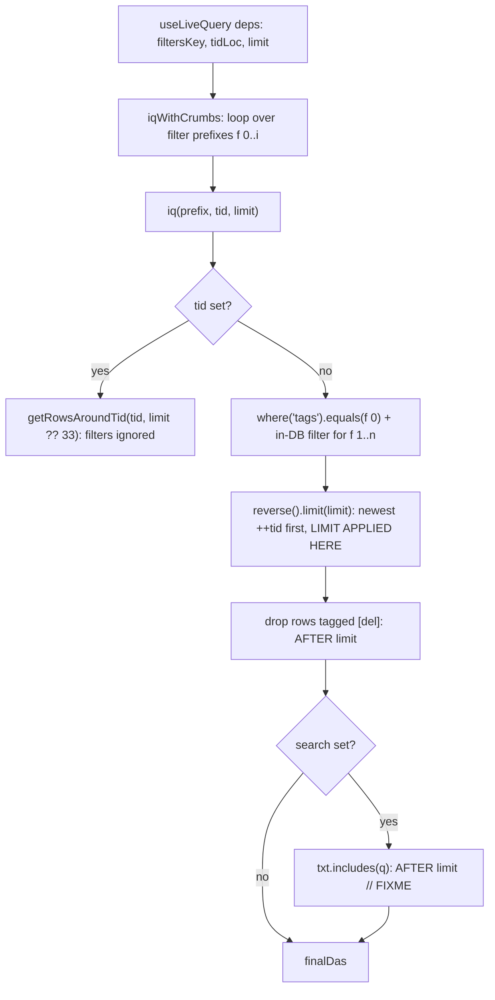

# Filter read path

`f` (filters csv) drives one reader: `useLiveQuery` -> `iqWithCrumbs` -> `iq`. `limit` decides how many rows are read *before* the `[del]` filter, so the visible count is a function of `limit`, not of how many rows match. No view wires search; `iq` keeps its `search` argument (`src/sdb.ts:100`) for a future caller.

## Order of operations

`[del]` filtering runs after `limit` (`src/sdb.ts:123`, `// FIXME beyond limit full search`), so a page can come back shorter than asked for while older rows remain. Order is descending `++tid` (insertion), not `rec.visitTime`.

## View switch

`treeCac['tabSeer']` selects the view, `treeCac['cardSeer']` the pin-row renderer, and `treeCac['restGrouper']` how the rows below the pins are grouped (`src/sdb.ts:61-70`).

| Setting | Value | View |
|---|---|---|
| `tabSeer` | `'card'` | `BadCardTab` (`src/ui/tabs.tsx:41`), fixed 555-row window |
| `tabSeer` | anything else | `CardTab` (`src/ui/cardTab.tsx`), window grows by page |
| `cardSeer` | `'cs1'` | pin rows render `Cs1Renderer` (`src/ui/cs1.tsx`) |
| `cardSeer` | `'cs2'` | pin rows render the cropped preview row (`Cs2Renderer`) |
| `restGrouper` | `'rsdt'` (default) | rest rows split into one block per exact `dt`, newest first (`src/ui/restGrouper.ts`) |
| `restGrouper` | `'rsid'` | `rsdt` plus one visit-time subgroup per exact `rec.visitTime` inside each date block; rows without a visit time stay under the date heading |
| `restGrouper` | `'rstag'` | the `rsdt` blocks unchanged, plus each row's `srctag` suggestions as dotted-outline chips; hovering a chip names the channels that produced it |
| `restGrouper` | `'none'` or empty | rest rows render flat, without headings |
| `restGrouper` | any other ref | the `type='src'` row of that ref returns the blocks; a block carries `items`, `subgroups`, or both. A missing row, a throwing body, or a result that is not an array of blocks falls back to flat |

Every built-in sorts the rows by `tid` descending before grouping, so each block
reads in insertion order (`iq` already returns that order).

`cardSeer` and `restGrouper` apply without a reload: both are read through
`useTreeCac` (`src/ui/useTreeCac.ts`), which subscribes to the `tree` row the
settings menu writes. `tabSeer` still reads `treeCac` directly at render.

Rest rows always render the cropped preview row: the whole `txt` stays in
the DOM, clipped to `22ch` by CSS (`src/ui/cardTab.tsx:21`), so browser
find-in-page still matches the clipped tail.

## CardTab vs BadCardTab

| | CardTab | BadCardTab |
|---|---|---|
| call | `iqWithCrumbs(filtersStable, undefined, Number(tidLoc), limit)` (`src/ui/cardTab.tsx:61`) | identical (`src/ui/tabs.tsx:48`) |
| deps | `[filtersKey, tidLoc, limit]` (`:64`) | `[filtersKey, tidLoc]` (`src/ui/tabs.tsx:52`) |
| limit | `useState(PAGE)` with `PAGE = 555` (`:54`), reset when `filtersKey`/`tidLoc` change (`:69-71`) | constant 555 (`src/ui/tabs.tsx:42`) |
| growth | sentinel `IntersectionObserver` while `canGrow = !tidLoc && das.length >= limit` (`src/ui/cardTab.tsx:111-122`) | none |
| rows | pin rows in a 66vh split, then rest rows grouped by `restGrouper` | same |
| page end | `No data found` / `Loading more...` / `No more data` (`src/ui/cardTab.tsx:169`) | `No data found` only when the page is empty |

Same call and same arguments at the same `limit`: CardTab never returns rows BadCardTab would not return; only the growth differs. `FilterBar` reads the same way at a fixed 555 for its crumb options (`src/ui/FilterBar.tsx:51`).

## Looks like fewer CardTab results, but is not the query

| Cause | Evidence |
|---|---|
| Pins occupy a fixed 66vh, each row squeezed to `66/pinCount vh` with its own `overflow: auto` | `src/ui/cardTab.tsx:124`, `:129` |
| `.rest-das` has no height, so `.left-panel` scrolls the whole view instead | `src/ui/cardTab.tsx:145`, `index.html:36` |
| `card-tab`, `pin-cards`, `pin-card-row`, `rest-das`, `rest-group`, `rest-group-head`, `da-row`, `end-message` have no rule in `index.html` or `src/tw4.css` | inline styles only |
| a short page ends the window early and reports "No more data" without a count | `src/sdb.ts:123`, `src/ui/cardTab.tsx:112` |

## Crumb cache

Only crumbs are cached: `availableDas(tags)` keyed by `{f, s, t, l}` (`src/sdb.ts:210-215`); `iq` re-runs per prefix on every read (`:227`). Crumbs therefore inherit both the limit and the post-limit filters.

## Tagging seams (`src/srctag.ts`)

`src/srctag.ts` scores and writes `tags[]`. It imports only `src/runsrc.ts` and takes rows structurally as `{ tid, txt, ref, type, tags, dt, modAt, rec }`, which is what keeps it free of Dexie, React and the DOM; `src/ui/tagApply.ts`, `src/ui/tap.tsx` and the `rstag` grouper are its callers.

### Channels

| Channel | Source | Default weight |
|---|---|---|
| TF-IDF | `txt` tokens plus `urlTokens(ref)` and any Markdown link in `txt`, against the neighbour window | 0.35 |
| Embedding cosine | an injected `EmbedFn` against the neighbour centroid; `hashEmbed` (64-bin character histogram) when none is supplied | 0.35 |
| Priority tags | `#tag` tokens in pin md-card headings (`pinPriorityTags`, the same rules `Cs1Renderer` renders) | 0.20 |
| Classifier labels | an injected `ClassifyFn` | 0.10 |

`KeywordTagger` is the FlashText seam: a trie of the priority tags plus `srctag/keywords.md` surface forms, scanned once per row, longest match wins, and a hit lifts the priority channel by `keywordBoost` (1.5). `tokenize` cuts Latin runs on non-alphanumerics and CJK runs into sliding bigrams. Every weight lives in `DEFAULT_TAG_SCORE` and is overridable per call; none is persisted.

### Window and clusters

`TagWindowConfig.dim` chooses the ordering — `tid` (insert order), `dt`/`modAt`, or `rec.visitTime`, read through the typo `rec.visitTIme` and the keys of `rec.access2discard` the way `sdb.maxRecKey` does — and `defaultWindow(dim)` seeds `burstGap` and `denseSpan` in that dimension's own unit (rows for `tid`, milliseconds otherwise). `neighbourhood` shrinks the radius when `denseCount` rows sit within `denseSpan`, grows it when a row has at most one local neighbour, and clamps to `[minWindow, maxWindow]`; `clusterRows` cuts where consecutive stamps differ by more than `burstGap`.

### Dynamic callers

`srctag/embed.js` and `srctag/classify.js` are `type='src'` rows evaluated by `runsrc.runBody`, so the caller is data rather than code: a function body `return`s the adapter, a module exports `default (ctx) => adapter`, and `ctx` is how the row reaches `db` for its key. `srctag/suggest.js` is the third row and returns a report instead of an adapter: it scores one row set under each neighbourhood rule — `tid`, `dt`, `visitTime`, plus the `suffix_*` tag `fc.txtRx` writes on a title tail, where the rows sharing a tag become one another's neighbourhood — and reports each rule's suggestion count, distinct tags, mean and max score, priority-tag hits, and its Jaccard overlap with `tid`, so the caller can see which rule proposes more. Its `ctx.args.provider`/`model` reach the embed and classify rows, which read the same args; `srctag/suggest-ds.js` is that same body with those defaults set to the `ds` provider, so a caller naming no provider still resolves through `ds` instead of the adapters' own `cfw` / `cjev`. `src/srctagRows.ts` holds all three bodies as text plus `srctag/keywords.md`, and `seedTagRows` / `clearTagRows` write and tombstone them (a ref that already has a live row is kept, not overwritten). Nothing seeds them on its own: the `Tag adapters (smoke)` item in the userbar settings menu (`src/ui/srctagSmoke.ts`) seeds them, loads them through `loadAdaptersFromStore`, and runs one live call per adapter, reporting each failure as a line instead of throwing. A body resolves its endpoint from `secret.md` under `## Providers` / `### <name>` (`* Base URL:`, `- alias: model` under `* Models:`, the first `- name: key` under `* API Keys:`), with `ctx.args` choosing the provider and model alias — `{ provider: 'ere', model: 'nbed' }` moves the same row from Cloudflare to OpenRouter. The request follows the Base URL: a `/ai/run` root posts `{ text: [...] }` and reads `result.data`; anything else posts `{ model, input, encoding_format }` and reads `data[].embedding`; the classifier row posts `{ inputs, labels, instructions }` to `{base}/v1/classify` and normalizes `labels` / `results` / `outputs` / a bare array. Each body inherits the secret reader and the normalizer as text, because a `data:`-URL module cannot import; the secret is read per call, so an unknown provider or a missing key is the caller's error to report rather than a row that silently fails to load. The in-process clients (`createEmbedClient`, `createCloudflareEmbed`, `createClassifierDevClassify`) stay available for callers that hold a key directly, and `embedWithCache` memoizes per `model|text` through a caller-supplied `TagVectorCache`. The unused `vecs` table (`[tid+mdl]`) is the intended backing store; its key is row-based, so a text edit leaves the stored vector stale.

### Write path

`planTagUpdates` turns results into `{ tags, rec }`. `add` only adds, `replaceAuto` also removes tags the row's own `rec.tagAuto` provenance names, `replace` sets the list outright, and `[del]` plus the `keep` list survive all three. `dexieTagPort` writes `tags`, `rec` and a local `modAt`; `commitTagUpdates` sequences writes; a row without a `tid` is skipped. `dexieTagPort` does not shelf a version the way `sdb.daEdit` does, so an auto-written tag never reaches the diff tab; `src/ui/tagApply.ts` is the app-side port that writes through `daEdit` instead. Because `rec` merges by union (`fc.recMerge` through `sdb.deepMerge`), a provenance key removed on one client returns when a copy still carrying it merges in.

### Entry points

| Use | Call | Default window |
|---|---|---|
| pin card saved | `tagRowsForPinSave(pins, rows)` | `visitTime` |
| agent chat, user-picked rows | `tagRowsInteractive(rows, tids)` | `tid` |
| extension tab sweep | `tagSweepRows(rows)` | `tid` |
| rest-list chips (`rstag`) | `tagRowReports(rows)` via `ui/restGrouper.restTagMap` | `tid` |
| rule comparison (`run_src`) | `run_src('srctag/suggest.js')` | all four, side by side |

All of them are `tagRows` with defaults; `onlyTids`, `priorityTags`, `synonyms`, `embed`, `embeddings`, `classify` and `labels` are per-call options.

`tagRowReports` is the read-only entry point: it scores with the lexical channels alone unless `embed`/`classify` is injected, and returns one `RowTagReport` per row — the window and cluster the score was measured in, plus one `TagExplanation` per tag. `explainTag` splits a suggestion into its channel shares, so `channels[].contribution` adds up to `score` (a trie hit is reported as a base `priority` share plus the extra `flashtext` share), and `explanationText` formats that as the hover text. `installSrctagGlobal()` publishes `srctagApi()` on `globalThis.srctag` so a `run_src` row can call it — a `data:`-URL module cannot resolve a relative import — and `src/ui/routes.tsx` calls it at boot.

Written tags land in the `*tags` MultiEntry index that `iq` and `availableDas` read, so a tag write is immediately a filter crumb; `rec.tagAuto` is read by nothing in the read path. The userbar search box tags the rows its dropdown shows (`src/ui/tagApply.ts`): the query's tokens become priority tags, the write is add-only, and the toast carries a revert. Focusing the empty box shows two zones instead of results — `srctag`'s suggestions, ranked by the rest list's own pass (`restTagStore.rank`: tags ordered by how many scored rows suggest them, then by best score; clicking applies one), then the most used tags from `availableDas` (clicking searches one). `iq`'s `search` argument is still unwired.

### Read-only chips (`restGrouper: 'rstag'`)

`rstag` is `rsdt` plus a tag layer: the blocks come from `groupByDt` synchronously, while `ui/restGrouper.restTagMap` scores the newest 200 rows in a live query and returns `Map<tid, RowTagReport>`, dropping any tag a row already carries. Each report's tags render **in front of** its row as dotted-outline chips (`src/ui/cardTab.tsx`), so a tag reads as the delimiter of the item it precedes, and the row carries a capline — an overline, the opposite of the hover underline — in its leading tag's color, which is the same color that chip uses. That color is `getColorChar11`'s hue lifted, because the panel is dark and the function draws tags at lightness 0.2 for the filled chips the hover preview and cs1 paint. The rows' own tags seed the trie's priority channel, so a row that carries `react` still lends `react` to its neighbours. Nothing is written, and a chip's `title` carries `explanationText`: the score, the `tfidf`/`embed`/`priority`/`flashtext`/`classify` shares, the neighbour window, and the reminder that the tag is only a suggestion. Persisting one is still the search box's job.

## Hover preview

Any row that carries content previews itself on hover: the cs1 pin-card matches
(`.cs1-match` buttons, `src/ui/cs1.tsx`) and the rest rows (`Cs2Renderer`,
`src/ui/cardTab.tsx` and `src/ui/tabs.tsx`). The cs2 pin row and the url rows keep
their native `title` tooltip.

One popover serves the whole list (`src/ui/Tip.tsx`): a single `mouseover` /
`focus` pair on a `display: contents` wrapper, a 160 ms hover delay, and a
200-entry markdown cache. Rows register themselves through `setTip` in a `ref`
callback, so no list re-render is needed to keep previews current.

The body follows `da.type`: `md` renders markdown (math deferred, below), `src`
shows the row through the editor pane's CodeMirror setup read-only, and every
other type prints as plain text. The first line carries the sync ages, `tid: <n>`
when the row has one, and the row's tags as chips colored by `getColorChar11` —
the same color `cs1` gives that tag's button.

The popover is placed flush under the row (`top: row.bottom - 1`) and shares the
row's left edge, so the pointer can travel from the row into the preview without
crossing a gap. Leaving the row starts a 220 ms close timer that the popover
cancels on entry, so a hover that ends on the preview stays open.

## Markdown parse and render

`src/md.ts` holds two markdown-it instances, `mdParse` (`html: true`) and
`mdRender` (`html: false`). Rows come from another device through Postgres, so
display escapes raw HTML; parsing keeps it as a node so a slice reproduces the
source. Both disable `table` and `strikethrough` to match the line-based split
the rows were captured against.

`src/mdTree.ts` builds an mdast-shaped tree from markdown-it tokens: block ranges
from `token.map` through a line-offset table, inline offsets by scanning between
block markers. The row builders (`src/ui/remark-list.ts`, `src/conv_md_yaml.ts`,
`fc.md2tag`) keep their offset arithmetic unchanged and read that tree.

Math is `$..$` (inline) and `$$..$$` (display). Rules emit `` holding the TeX; `hydrateMath` imports `temml` on the first formula and
replaces each placeholder with MathML. `temml` therefore stays in its own chunk
and the preview never waits for it.
