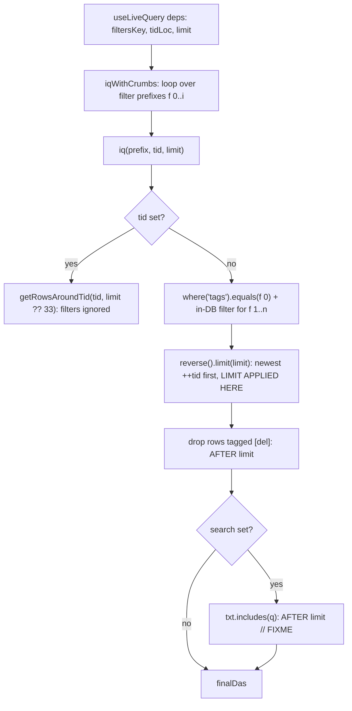

# Filter read path

`f` (filters csv) drives one reader: `useLiveQuery` -> `iqWithCrumbs` -> `iq`. `limit` decides how many rows are read *before* the `[del]` filter, so the visible count is a function of `limit`, not of how many rows match. No view wires search; `iq` keeps its `search` argument (`src/sdb.ts:88`) for a future caller.

## Order of operations

`[del]` filtering runs after `limit` (`src/sdb.ts:104`, `// FIXME beyond limit full search`), so a page can come back shorter than asked for while older rows remain. Order is descending `++tid` (insertion), not `rec.visitTime`.

## View switch

`treeCac['tabSeer']` selects the view, `treeCac['cardSeer']` the pin-row renderer (`src/sdb.ts:62-68`).

| Setting | Value | View |
|---|---|---|
| `tabSeer` | `'card'` | `BadCardTab` (`src/ui/tabs.tsx:41`), fixed 555-row window |
| `tabSeer` | anything else | `CardTab` (`src/ui/cardTab.tsx`), window grows by page |
| `cardSeer` | `'cs1'` | pin rows render `Cs1Renderer` (`src/ui/cs1.tsx`) |
| `cardSeer` | `'cs2'` | pin rows render the cropped preview row (`Cs2Renderer`) |

Ungrouped rows always render the cropped preview row: the whole `txt` stays in
the DOM, clipped to `33ch` by CSS (`src/ui/cardTab.tsx:17`), so browser
find-in-page still matches the clipped tail.

## CardTab vs BadCardTab

| | CardTab | BadCardTab |
|---|---|---|
| call | `iqWithCrumbs(filtersStable, undefined, Number(tidLoc), limit)` (`src/ui/cardTab.tsx:46`) | identical (`src/ui/tabs.tsx:48`) |
| deps | `[filtersKey, tidLoc, limit]` (`:49`) | `[filtersKey, tidLoc]` (`src/ui/tabs.tsx:52`) |
| limit | `useState(PAGE)` with `PAGE = 555` (`:39`), reset when `filtersKey`/`tidLoc` change (`:54-56`) | constant 555 (`src/ui/tabs.tsx:42`) |
| growth | sentinel `IntersectionObserver` while `canGrow = !tidLoc && das.length >= limit` (`src/ui/cardTab.tsx:66-76`) | none |
| rows | pin rows in a 66vh split, then ungrouped rows | same |
| page end | `No data found` / `Loading more...` / `No more data` (`src/ui/cardTab.tsx:109`) | `No data found` only when the page is empty |

Same call and same arguments at the same `limit`: CardTab never returns rows BadCardTab would not return; only the growth differs. `FilterBar` reads the same way at a fixed 555 for its crumb options (`src/ui/FilterBar.tsx:51`).

## Looks like fewer CardTab results, but is not the query

| Cause | Evidence |
|---|---|
| Pins occupy a fixed 66vh, each row squeezed to `66/pinCount vh` with its own `overflow: auto` | `src/ui/cardTab.tsx:83`, `:88` |
| `.ungrouped-das` has no height, so `.left-panel` scrolls the whole view instead | `src/ui/cardTab.tsx:98`, `index.html:36` |
| `card-tab`, `pin-cards`, `pin-card-row`, `ungrouped-das`, `da-row`, `end-message` have no rule in `index.html` or `src/tw4.css` | inline styles only |
| a short page ends the window early and reports "No more data" without a count | `src/sdb.ts:104`, `src/ui/cardTab.tsx:66` |

## Crumb cache

Only crumbs are cached: `availableDas(tags)` keyed by `{f, s, t, l}` (`src/sdb.ts:210-215`); `iq` re-runs per prefix on every read (`:227`). Crumbs therefore inherit both the limit and the post-limit filters.
