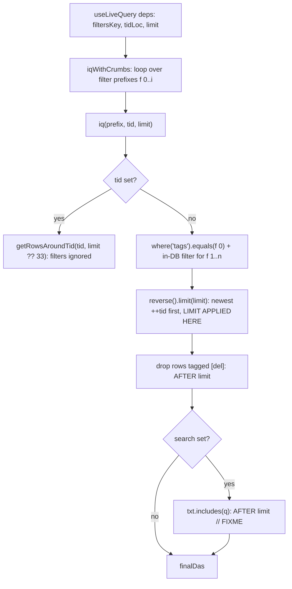

# Filter read path

`f` (filters csv) drives one reader: `useLiveQuery` -> `iqWithCrumbs` -> `iq`. `limit` decides how many rows are read *before* the `[del]` filter, so the visible count is a function of `limit`, not of how many rows match. No view wires search; `iq` keeps its `search` argument (`src/sdb.ts:100`) for a future caller.

## Order of operations

`[del]` filtering runs after `limit` (`src/sdb.ts:123`, `// FIXME beyond limit full search`), so a page can come back shorter than asked for while older rows remain. Order is descending `++tid` (insertion), not `rec.visitTime`.

## View switch

`treeCac['tabSeer']` selects the view, `treeCac['cardSeer']` the pin-row renderer, and `treeCac['restGrouper']` how the rows below the pins are grouped (`src/sdb.ts:61-70`).

| Setting | Value | View |
|---|---|---|
| `tabSeer` | `'card'` | `BadCardTab` (`src/ui/tabs.tsx:41`), fixed 555-row window |
| `tabSeer` | anything else | `CardTab` (`src/ui/cardTab.tsx`), window grows by page |
| `cardSeer` | `'cs1'` | pin rows render `Cs1Renderer` (`src/ui/cs1.tsx`) |
| `cardSeer` | `'cs2'` | pin rows render the cropped preview row (`Cs2Renderer`) |
| `restGrouper` | `'rsdt'` (default) | rest rows split into one block per exact `dt`, newest first (`src/ui/restGrouper.ts`) |
| `restGrouper` | `'rsid'` | `rsdt` plus one visit-time subgroup per exact `rec.visitTime` inside each date block; rows without a visit time stay under the date heading |
| `restGrouper` | `'rstag'` / `'rstext'` | the `rsdt` blocks unchanged, plus each row's `srctag` suggestions as dotted-outline chips in a cropped, scrollable strip (solid and italic for a promoted `parent/theme` sub-tag); hovering a chip names the channels that produced it and every scored row proposing it ([sTag.md](sTag.md#read-only-chips-restgrouper-rstag)) |
| `restGrouper` | `'rsfreq'` / `'rstrank'` / `'rstt'` | the same blocks and chips scored by one channel family instead of the fused mix — TF-IDF, the two TextRank walks, or the TurboText trie — with the pin cards' `#tag` headings as the priority tags, the aim pass on, and a visualization switch plus hyperparameters above the blocks ([sTag.md](sTag.md#algorithm-groupers-rsfreq-rstrank-rstt)) |
| `restGrouper` | `'none'` or empty | rest rows render flat, without headings |
| `restGrouper` | any other ref | the `type='src'` row of that ref returns the blocks; a block carries `items`, `subgroups`, or both. A missing row, a throwing body, or a result that is not an array of blocks falls back to flat |

Every built-in sorts the rows by `tid` descending before grouping, so each block
reads in insertion order (`iq` already returns that order).

`cardSeer` and `restGrouper` apply without a reload: both are read through
`useTreeCac` (`src/ui/useTreeCac.ts`), which subscribes to the `tree` row the
settings menu writes. `tabSeer` still reads `treeCac` directly at render.

Rest rows always render the cropped preview row: the whole `txt` stays in
the DOM, clipped to `22ch` by CSS (`src/ui/cardTab.tsx:21`), so browser
find-in-page still matches the clipped tail.

## CardTab vs BadCardTab

| | CardTab | BadCardTab |
|---|---|---|
| call | `iqWithCrumbs(filtersStable, undefined, Number(tidLoc), limit)` (`src/ui/cardTab.tsx:61`) | identical (`src/ui/tabs.tsx:48`) |
| deps | `[filtersKey, tidLoc, limit]` (`:64`) | `[filtersKey, tidLoc]` (`src/ui/tabs.tsx:52`) |
| limit | `useState(PAGE)` with `PAGE = 555` (`:54`), reset when `filtersKey`/`tidLoc` change (`:69-71`) | constant 555 (`src/ui/tabs.tsx:42`) |
| growth | sentinel `IntersectionObserver` while `canGrow = !tidLoc && das.length >= limit` (`src/ui/cardTab.tsx:111-122`) | none |
| rows | pin rows in a 66vh split, then rest rows grouped by `restGrouper` | same |
| page end | `No data found` / `Loading more...` / `No more data` (`src/ui/cardTab.tsx:169`) | `No data found` only when the page is empty |

Same call and same arguments at the same `limit`: CardTab never returns rows BadCardTab would not return; only the growth differs. `FilterBar` reads the same way at a fixed 555 for its crumb options (`src/ui/FilterBar.tsx:51`).

## Looks like fewer CardTab results, but is not the query

| Cause | Evidence |
|---|---|
| Pins occupy a fixed 66vh, each row squeezed to `66/pinCount vh` with its own `overflow: auto` | `src/ui/cardTab.tsx:124`, `:129` |
| `.rest-das` has no height, so `.left-panel` scrolls the whole view instead | `src/ui/cardTab.tsx:145`, `index.html:36` |
| `card-tab`, `pin-cards`, `pin-card-row`, `rest-das`, `rest-group`, `rest-group-head`, `da-row`, `end-message` have no rule in `index.html` or `src/tw4.css` | inline styles only |
| a short page ends the window early and reports "No more data" without a count | `src/sdb.ts:123`, `src/ui/cardTab.tsx:112` |

## Crumb cache

Only crumbs are cached: `availableDas(tags)` keyed by `{f, s, t, l}` (`src/sdb.ts:210-215`); `iq` re-runs per prefix on every read (`:227`). Crumbs therefore inherit both the limit and the post-limit filters.

## Tagging (`src/srctag.ts`, `src/srctagRows.ts`)

How a row's `tags[]` are scored and written is documented in [sTag.md](sTag.md), split by
methodology: the static channels in `src/srctag.ts` (TF-IDF, TextRank, the TurboText
keyword automaton, `hashEmbed`, the priority and classifier shares) and the dynamic
`type='src'` rows `run_src` evaluates (`srctag/embed.js`, `srctag/classify.js`,
`srctag/suggest.js`, `srctag/suggest-ds.js`).

This document keeps what the read path needs: `rstag` and `rstext` in the View switch
above render those suggestions as chips, and the hover preview prints the per-channel
shares `explainTag` computes.

## Hover preview

Any row of the list previews itself on hover — the cs1 pin-card matches
(`.cs1-match`, `src/ui/cs1.tsx`) and every rest row (`Cs2Renderer`,
`src/ui/cardTab.tsx` and `src/ui/tabs.tsx`), `http(s)` and recr rows included. Only
the cs2 pin row keeps its native `title` tooltip.

One popover serves the whole list (`src/ui/Tip.tsx`): a single `mouseover` /
`focus` pair on a `display: contents` wrapper, a 160 ms hover delay, and a
200-entry markdown cache. Rows register themselves through `setTip` in a `ref`
callback, so no list re-render is needed to keep previews current.

The body follows `da.type`: `md` renders markdown (math deferred, below) inside
`.tip-md`, which restores the heading weight, list markers and block margins
Tailwind's preflight flattens; `src` shows the row through the editor pane's
CodeMirror setup read-only, highlighted as JavaScript whenever the ref's suffix
names no other grammar; every other type prints `txt || ref` as plain text, which
is what a link row shows. The first line carries the sync ages, `tid: <n>` when the
row has one, and the row's tags as chips colored by `getColorChar11` — the same
color `cs1` gives that tag's button.

The popover is placed flush under the row (`top: row.bottom - 1`) with its left
edge on the list container's, so every row of one list previews in the same
column and the pointer can still travel down into it. `tipFittedLeft` slides the
rendered panel left when a wide body would leave the viewport's right edge.
Leaving the row starts a 220 ms close timer that the popover cancels on entry, so
a hover that ends on the preview stays open.

## Markdown parse and render

`src/md.ts` holds two markdown-it instances, `mdParse` (`html: true`) and
`mdRender` (`html: false`). Rows come from another device through Postgres, so
display escapes raw HTML; parsing keeps it as a node so a slice reproduces the
source. Both disable `table` and `strikethrough` to match the line-based split
the rows were captured against.

`src/mdTree.ts` builds an mdast-shaped tree from markdown-it tokens: block ranges
from `token.map` through a line-offset table, inline offsets by scanning between
block markers. The row builders (`src/ui/remark-list.ts`, `src/conv_md_yaml.ts`,
`fc.md2tag`) keep their offset arithmetic unchanged and read that tree.

Math is `$..$` (inline) and `$$..$$` (display). Rules emit `` holding the TeX; `hydrateMath` imports `temml` on the first formula and
replaces each placeholder with MathML. `temml` therefore stays in its own chunk
and the preview never waits for it.
