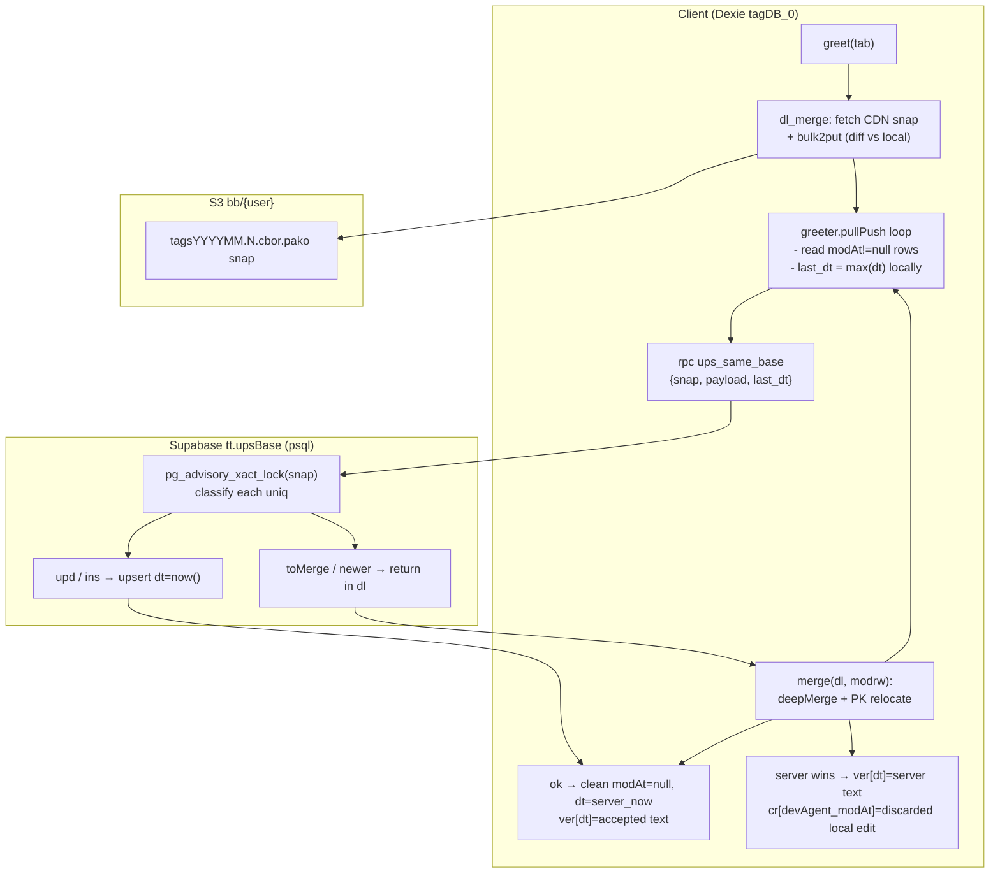
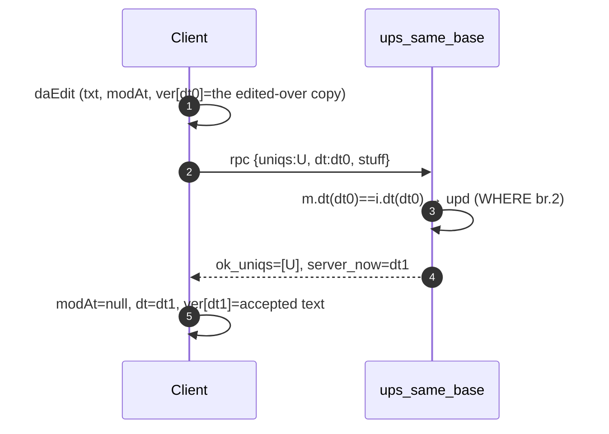
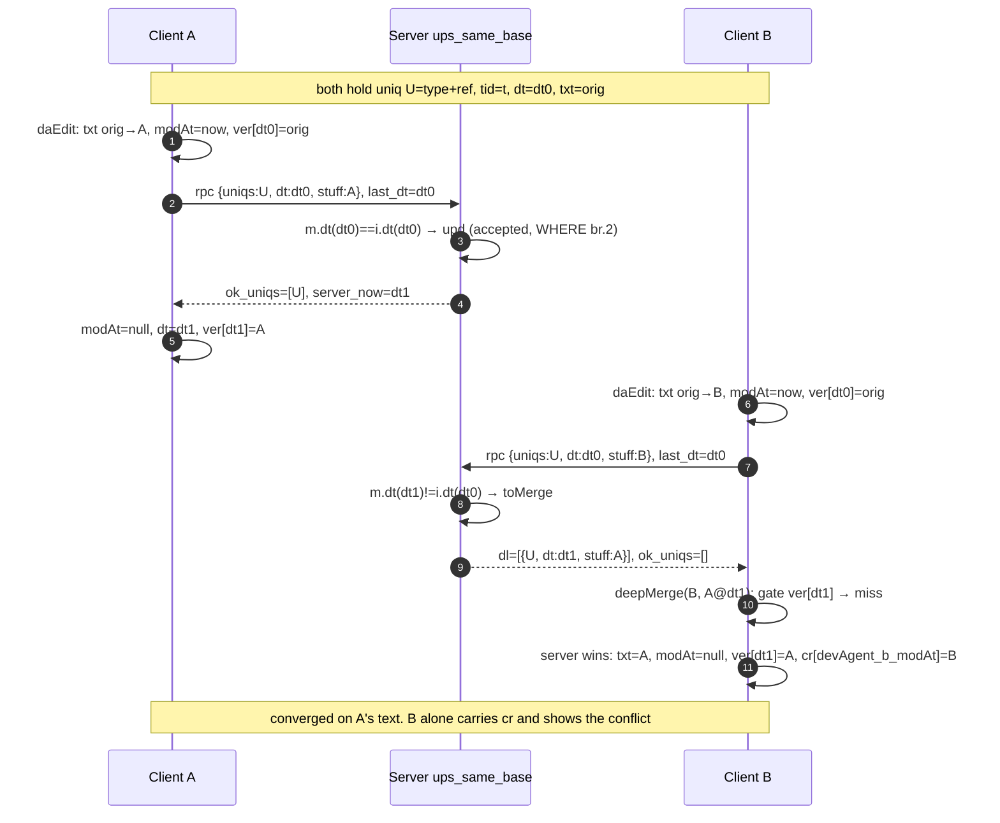
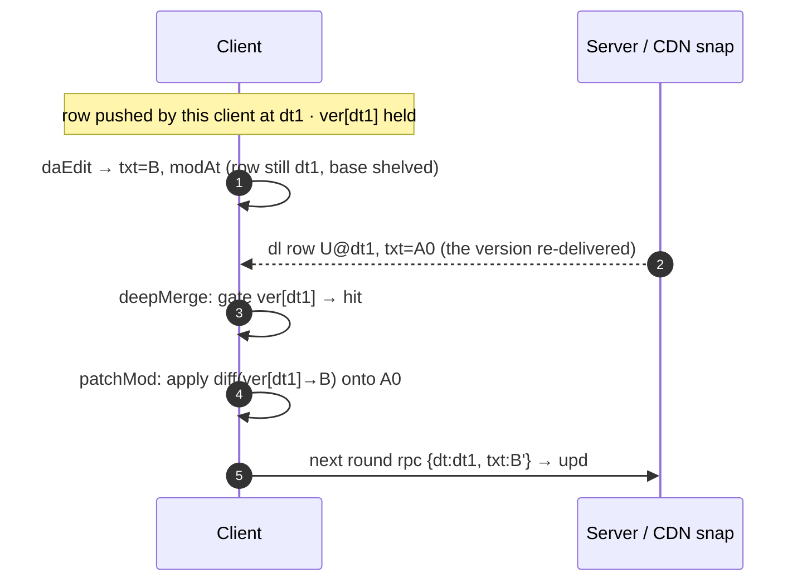
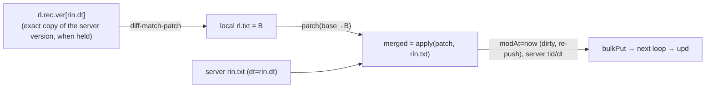
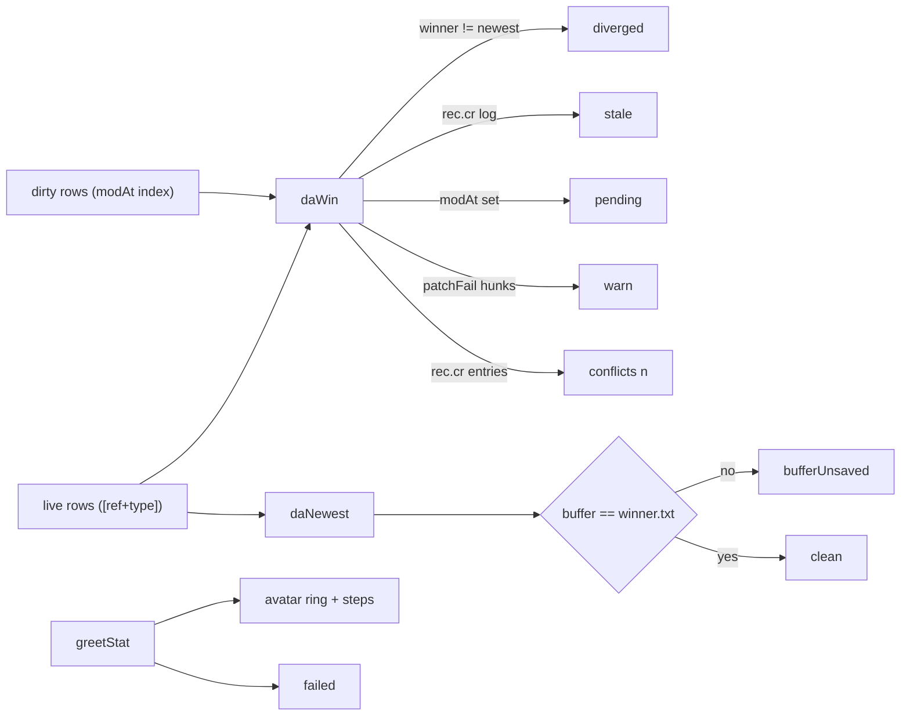

# greet() — live RPC sync over CDN snap (xbb)

Adapted from `tabext/docs/sync.md` (bulk snap + RPC pull/push, LanceDB-style
catchupRead → privateMerge → atomicCAS → retry), grounded in:

- `src/greet.ts` — `Greeter.pullPush`, `merge`, `row2put`, `dl_merge`, `bulk2put`
- `src/sdb.ts` — `Da`, `daUniq`, `deepMerge`, `patchMod`, `recMerge`
- `tabext/src/ups_same_base.sql` — authoritative server CAS (schema `tt.upsBase`)

Entity: `Da { tid, txt, ref, type, tags?, dt, modAt, rec }`
- `uniqs` (semantic key) = `type + ref`
- `pk` (local) = `tid` (auto-increment per client — see Risk R3)
- `dt` = server time (only server writes it), `modAt` = local dirty flag
- `rec.ver[dt]` = the server versions this client has held, keyed by their ISO `dt`
- `rec.cr[devAgent_modAt]` = discarded local edits, keyed by the discarding client's
  `devAgent` plus their ISO `modAt`; a row that carries one is tagged `FIXMEchange_rejected`

---

## 1. Data flow overview

---

## 2. The essential cases of one uniq

One uniq (`ref`+`type`) resolves in three ways, decided by the row's `rec.ver`. A
version enters it when this client takes delivery of it: its own accepted push, a
`deepMerge` adoption, another client's entry carried inside the row's `rec`, or the base
`sdb.daEdit` shelves from the row an edit is based on.

| case | when | server category | outcome on this client |
|:--|:--|:--|:--|
| 1 accepted | the row's `dt` is still the server's | `ins` / `upd` | clean; `ver[server_now]` = the text the server accepted |
| 2 discarded | the server moved (or the row carries no `dt` of its own) and `ver` holds no copy of the server's version | `toMerge` | server text; `cr[devAgent_modAt]` = the local text; the diff tab offers it back |
| 3 patched | the server moved and `ver` *does* hold its version | `toMerge` | `patchMod` re-applies the local delta onto the server text; the row re-pushes |

**Case 1 — same base.** The everyday path: the edit meets the server where it left it.

**Case 2 — the essence conflict.** Two clients leave the same base at once; B's push is
stale, and B cannot reproduce the version A's `dl` row carries, so A's text stands and
B's edit moves to `cr`. This is the case the whole `cr` + diff-tab flow exists for.

`daEdit` shelves the base, but the gate wants the version the *server* now names:
`toMerge` returns a `dt` newer than the base the local row carries, so the copy held is
the one the edit was made from, not the one the server delivers. That is why case 2 is
the norm in the live loop (§7 R1). The greet round that wrote the `cr` entry announces it
(§6), and the diff tab offers each changed region of the entry against the text the row
carries now, one Apply button per region. Applying writes the row through `daEdit`, drops
that `cr` entry — with the last one, the `FIXMEchange_rejected` tag — and pushes.

**Case 3 — the gate hits.** The local delta is applied onto the server text, so both
edits survive. It fires on re-delivery of a version this client already holds — chiefly
the CDN snap path, where `bulk2put` merges a snap row of the very version the local edit
was based on (`test/ver.test.ts`), or two live rows of one uniq (R3). An inherited entry
(a `deepMerge` union of another client's `ver`) can supply the held version, but the
re-delivery is what makes its `dt` current again.

A region the patch cannot place keeps the server text for that region and is counted in
`rec.patchFail`; the tab shows ⚠ instead of losing it silently. See Risk R1.

---

## 3. `deepMerge`/`patchMod` — version-gated patch

`sdb.deepMerge(rl, rin)` (`sdb.ts`):
- takes `ver` and `cr` out of both `rec`s, runs `recMerge(rl.rec, rin.rec, 5)` on the rest,
  then unions both histories by hand (`mergeVer` for `ver`, a plain key union for `cr`,
  local entries winning): `recMerge` lets the server side win same-stamp entries, and a
  `cr` key names the client that discarded the edit, so the union keeps every client's log.
- **if `ver[rin.dt]` exists → `patchMod(rin, ver[rin.dt], rl)`**: `txt = patch_apply(patch_make(copy.txt, rl.txt), rin.txt)`, same for `tags` (joined/split on `\n`). Keeps server `tid`/`ref`/`type`/`dt`, sets `modAt=now` → row re-pushes. A hunk `patch_apply` cannot place keeps the server text for that region and is counted in `rec.patchFail = { at, hunks }`; the tab reports it (⚠) instead of losing the edit silently.
- **else → server wins**: returns `rin` clean (`modAt` unset, no re-push) carrying the
  merged `rec`, adopts the server version into `ver[rin.dt]`, and files the discarded
  local row under its `cr` key (`putCr`), marking the row `FIXMEchange_rejected`. The local
  text survives there for the diff tab; `daStale` (the row carries a `cr` log) and the
  tab's ⚠ both point at it.

`rec.ver[dt]` and `rec.cr[devAgent_modAt]` each hold `row` minus `rec` (history cannot
nest itself), keyed by `sdb.stamp` for `ver` and `sdb.crStamp` for `cr`. Neither history
is pruned.

**Writers.** `pullPush` records each version the server accepts (`ver[server_now]`),
and `deepMerge` records the adopted server version plus any discarded local edit.
`sdb.daEdit(row, txt)` shelves the base: the first edit of a clean row stores the row
under its own `dt`, so the ancestor exists without the writer knowing about it. The editor
(`saveToDb`, the tab-dropdown metadata and rename writes) and the agent store
(`IRecrStore.put`/`writeFile`) behave alike. `cr` travels: the RPC payload carries it,
`deepMerge` unions both sides, and a snap merge or a PK relocation carries the log onto
the row that replaces it (`withCr`). `upSnap` drops `rec.ver` from the snapshot
(`withoutVer`) — the CDN carries row state, not history.

**Early round.** `saveToDb` no longer waits for the network: it reads the winning row
(`daRead`), writes `daEdit`, and calls `softGreet()` to push in the background. The
editor also starts a round on focus, on the first keystroke of a burst, and when a tab
opens, so the local copy is usually at the server's `dt` before the edit lands.
Keystrokes typed while a round runs are reapplied onto the fetched text by
`ui/reapply.ts` (the same diff-match-patch recipe as `patchMod`, over the live buffer
with the loaded text as ancestor).

---

## 4. Server CAS (`tt.ups_same_base`) — actual SQL semantics

`tabext/src/ups_same_base.sql`, per uniq in the payload (`i`), joined to server
rows (`m`) for `md5(uniqs)` under `snap_name`:

| category | condition (i vs m) | WHERE admitted | server action |
|:--|:--|:--|:--|
| `ins` | `m.uniqs IS NULL` (new uniq) | only if `last_dt == xdt.max_dt` (snap-global max) | INSERT dt=now(), into `ok_uniqs` |
| `upd` | `m.dt == i.dt` | always (WHERE branch 2) | UPDATE dt=now(), into `ok_uniqs` |
| `toMerge` | `m.dt != i.dt` (stale client) | always (branch 2) | into `dl` (server row returned) |
| `newer` | `m.dt > last_dt`, not in payload | branch 3 | into `dl` (server row returned) |

Details from the real SQL (differ from sync.md's per-record pseudo-code):

- `ins` gate compares the **single `last_dt` against the snap-GLOBAL `max(dt)`**
  (`xdt`), not per-uniq. A client whose `last_dt` is behind the snap's newest row
  cannot insert any brand-new uniq until it catches up — `C-INS-2`/`C-BLK-2`
  failures trace here (test rows seeded with old fixed `dt`).
- `upd` is admitted even with a stale global `last_dt` (WHERE branch 2), so the
  first writer to race a `dt` wins and later `upd`s with a matching per-row dt
  also succeed. This is the "last writer with matching dt wins" serialization.
- `pg_advisory_xact_lock(hashtext(snap_name))` serializes writers per snap.
- `ok` uses `ON CONFLICT (snap, md5(uniqs)) DO UPDATE`, so a retried same-base
  push never duplicates (T3 idempotency).

---

## 5. Conflict matrix (client view)

| client (`i`) | server (`m`) | condition | category | client follow-up |
|:--|:--|:--|:--|:--|
| absent | exists | `m.dt > last_dt` | newer | download via `dl`, put clean |
| exists | absent | `last_dt == xdt.max_dt` | ins | accepted → clean |
| exists | exists | `m.dt == i.dt` | upd | accepted → clean |
| exists | exists | `m.dt != i.dt` | toMerge | `deepMerge`: patch when `rec.ver` holds `m.dt`, else server wins, `ver[m.dt]` adopted, local edit → `cr` |

Client retry loop (`pullPush`): `MIN_LOOP=3`, `MAX_RETRIES=1` → max 5 rounds;
breaks when a round returns empty `dl` + empty `ok_uniqs` + no `modrw`. On each
round `last_dt` is recomputed as local `max(dt)` (must advance to the server's
per-row dt for the toMerge'd row, else it keeps getting rejected until the cap).

---

## 6. Observable sync state per tab

`src/ui/tabState.ts` derives one tab's state from its live `db.das` rows plus the last
`greet()` outcome; `src/ui/tabSync.ts` binds it to Dexie (`useLiveQuery`) and to the greet
activity store (`useSyncExternalStore`). Two facts stay apart:

- **row obligation** — `draft` (no live row), `pending` (the winner carries `modAt`),
  `stale` (the winner carries a `cr` log: a local edit was discarded because the version it
  was based on was not held), `diverged` (the dirty-wins row is not the newest-`dt`
  row of the same `ref`+`type`, i.e. relocation left a second live row), `failed` (the last
  greet round failed while this row is dirty), else `clean`.
- **buffer** — `bufferUnsaved` when the editor's text differs from the row it displays.
- **`warn`** — a non-fatal alarm on an otherwise fine row: hunks `patchMod` could not place
  (`rec.patchFail`). It tints the tab and adds ⚠ without changing the row state.
- **`conflicts`** — the number of discarded local edits the shown row still carries
  (`rec.cr`). It tints the tab amber, adds ⚠, renders the count next to the label, and the
  row is tagged `FIXMEchange_rejected` so the tag UI can list it for cleanup.

| fact | source |
|:--|:--|
| winner of `ref`+`type` | `sdb.daWin` — a local edit shadows the clean copy; shared with `IRecrStore` |
| the row the editor shows | the same winner (`daRead`), so badge and body agree |
| live rows of a tab | `sdb.daRows` — `modAt` index plus `[ref+type]` for `md`/`src` |
| tombstoned key | `daLatest` (newest effective stamp): a `[del]` winner means the ref is gone |
| staged progress | `greetStat` checkpoints `list → dl snap → snap merge → rpc rN → accepted → round done → push done` |
| work in flight | `greetStat.inflight`, counted inside `greet` past the `greetTill` gate |
| discarded local edits | `shown.rec.cr`, written by `deepMerge` when the server wins and announced by the greet round |

`greet()` is a throttled singleton, so `inflight` is 0 or 1 and the avatar ring is
unambiguous; a throttled call returns `{}` without work and never counts. `Greeter.onError`
reports a failed RPC round or a stalled loop, and `Greeter.onStep` reports each checkpoint;
a 100 ms ticker creeps `frac` up to `0.08` past the last checkpoint so the ring keeps moving
during a network step.

Presentation: `diverged`/`stale`/`failed` and a `warn` tint the tab and add ⚠, `pending`
tints the label, an unsaved buffer italicizes it, and the detail line is the tab `title`,
the `.tab-dropdown-portal` meta row, and the avatar tooltip (which lists the slowest steps).
Only the active tab is marked.

**Discarded edits.** A round that dropped a local edit announces it from the merge site
(`sdb.drainCr`, drained into `getConflicts`/`subscribeConflicts`), and the editor opens the
diff tab for a row it already has open, at most one per batch — a snap merge must not open a
tab per row. The tab menu lists the row's `ver` and `cr` stamps; picking one opens the same
diff tab. `docs/difftab.md` owns the diff tab's own rules.

**Flush.** The buffer is written through `daEdit` when focus leaves the editor, when a
pointer goes down outside `.code-editor` (capture), when the page is hidden, on window
`blur`/`pagehide`/`freeze`, and after ~2 s of typing pause. A write that would not change
the row is skipped.

---

## 7. Known risks / divergences (from code + current test.log)

- **R1 – the patch gate needs the server's own version.** `ver[rin.dt]` is present only
  when this client held that exact version — one it pushed itself, one adopted by an
  earlier merge, one carried in through another client's `ver` union, or (since `daEdit`
  shelves what an edit is based on) the base a local edit started from. That last shelf is
  what makes a row this client only *downloaded* patchable once it has been edited, on
  re-delivery of that same version. A `toMerge` still carries a `dt` the local row does
  not name, so the miss branches on which side moved: `server-ahead` (another client
  advanced past this client's last greet/snap base — the ordinary live-loop case), or
  `server-behind` / `server-no-dt` / `no-base-dt` for a server row at or behind the local
  base with nothing held for it. Each miss is logged once per edit (`sdb.drainCr` carries
  the reason). The server copy wins and the local edit moves to `cr`, where the diff tab
  offers it back. Overlapping edits inside a patched row keep the server text for the
  hunks that do not apply (`rec.patchFail`).
- **R2 – `ins` gate is snap-global, not per-uniq.** A client behind the snap max
  is blocked from all new inserts until catchup; CDN-snap-seeded clients whose
  server has newer live rows loop to cap with dirty rows left (matches sync.md
  "suspected issue 2"). This is why `test/greet.test.ts` clears its own snap.
- **R3 – cross-client `tid` divergence (PK clash).** Tests pin the same `tid`
  (`mkTag(300,…)`) on both clients; in reality `tid` is per-client auto-increment,
  so the server row's `stuff.tid` differs from a downloader's local tid.
  `merge()` looks up displaced rows by `pk(serverStuff)`; a mismatched tid means
  the stale dirty local row is neither moved nor removed → **duplicate uniq rows
  locally** (sync.md §5 `ref(uniqs)` dup). No test covers naturally-different
  tids for the same uniq.
- **R4 – `last_dt` is global max(dt).** A toMerge'd row whose dt is older than
  another local row's dt can be rejected repeatedly; the loop caps at 5 rounds
  and leaves it dirty (recovered on next `greet()`).
- **`stale` covers the whole log, not the latest discard.** `daStale` is true while the row
  carries any `cr` entry, including one another client discarded, so the tab cannot tell a
  fresh discard from an old one; the announce list (§6) carries the reason instead.
- **Retiring a `cr` entry is not durable.** The log travels in the RPC payload and merges
  by key, but nothing deletes a key on the server: applying an entry (`diffTab`) drops it
  locally, and the next round that meets that server row merges it back. The
  `FIXMEchange_rejected` tag is derived from the same log, so it returns with it.
- **`cr` growth.** Neither `ver` nor `cr` is pruned, and a `cr` entry holds a full row
  snapshot. `modrwCheck`'s `rec` size log is the only signal; a cap belongs in `treeCac`.
- **Minor:** `toBackup` grows unbounded across `pullPush`; `merge()` calls `meta()`
  = `metaSet` (tid=-1 stat row), not a dl merge as its comment claims; test
  fixtures still use legacy `sts` field while `patchMod` reads `tags`; the stat row
  (tid -1) gains one `rec.ver` entry per round.

## 8. References

- `tabext/docs/sync.md` — parent OCC design (catchupRead/privateMerge/atomicCAS/retry)
- `tabext/src/ups_same_base.sql` — server RPC + T1–T5 assertions
- `docs/difftab.md` — the diff tab, its `diff|…` tab ref, and the apply rules
- `test/ver.test.ts` — `ver`/`cr` helpers, `deepMerge` gate, `patchMod` (no server)
- `test/diff.test.ts` — hunk splitting, ANSI runs, per-hunk apply
- `test/greet.test.ts` — live two-client edit, stale-push conflict, rename
