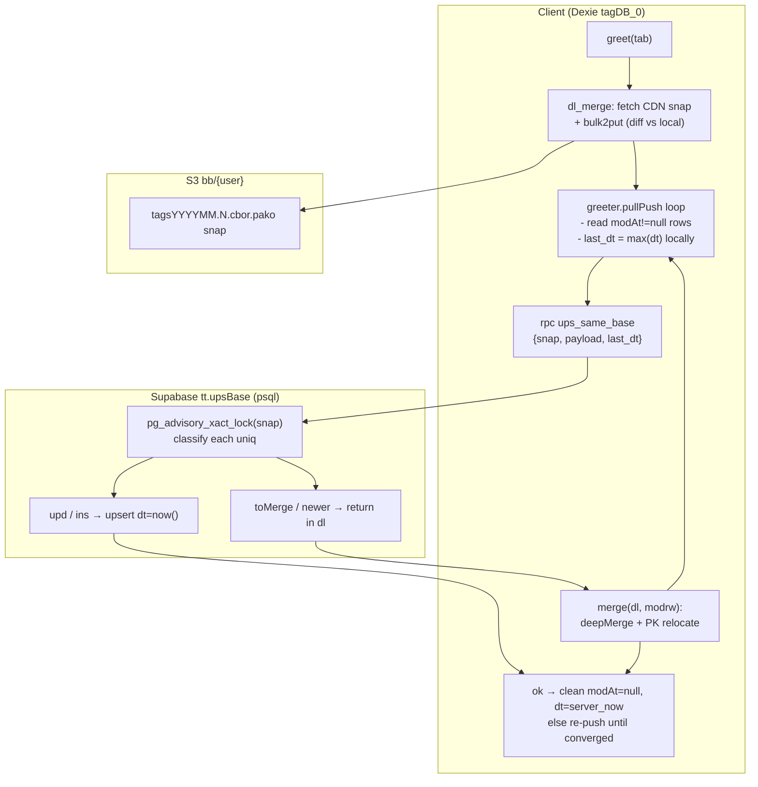
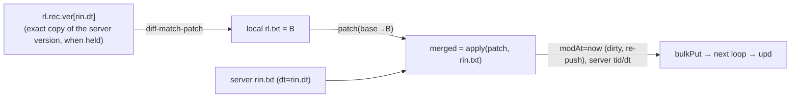

# greet() — live RPC sync over CDN snap (xbb)

Adapted from `tabext/docs/sync.md` (bulk snap + RPC pull/push, LanceDB-style
catchupRead → privateMerge → atomicCAS → retry), grounded in:

- `src/greet.ts` — `Greeter.pullPush`, `merge`, `row2put`, `dl_merge`, `bulk2put`
- `src/sdb.ts` — `Da`, `uniqsTag`, `deepMerge`, `patchMod`, `recMerge`
- `tabext/src/ups_same_base.sql` — authoritative server CAS (schema `tt.upsBase`)

Entity: `Da { tid, txt, ref, type, tags?, dt, modAt, rec }`
- `uniqs` (semantic key) = `type + ref`
- `pk` (local) = `tid` (auto-increment per client — see Risk R4)
- `dt` = server time (only server writes it), `modAt` = local dirty flag

---

## 1. Data flow overview



---

## 2. The scenario: 2 clients edit `txt` of the SAME uniq (`ref`+`type`)

This is the case the OCC loop exists for. Both clients start from the same base
row (`dt0`) and shelf that version into `rec.ver` on edit (§3). Client A pushes
first and wins `dt1`; Client B is stale, gets `toMerge`, and merges A's row with
`deepMerge`. The gate needs an exact copy of the version in the `dl` row — B
holds `dt0`, not `dt1` — so **A's version stands** and B's edit survives only as
history in B's own `rec.ver`.

```mermaid
sequenceDiagram
    autonumber
    participant A as Client A
    participant S as Server ups_same_base
    participant B as Client B

    Note over A,B: both hold uniq U=type+ref, tid=t, dt=dt0, txt=orig<br/>both shelved version dt0 into rec.ver on edit
    A->>A: txt orig→A, modAt=now
    A->>S: rpc {uniqs:U, dt:dt0, stuff:A}, last_dt=dt0
    S->>S: m.dt(dt0)==i.dt(dt0) → upd (accepted, WHERE br.2)
    S-->>A: ok_uniqs=[U], server_now=dt1
    A->>A: modAt=null, dt=dt1, ver += dt1:A (clean, txt=A)
    B->>B: txt orig→B, modAt=now
    B->>S: rpc {uniqs:U, dt:dt0, stuff:B}, last_dt=dt0
    S->>S: m.dt(dt1)!=i.dt(dt0) → toMerge
    S-->>B: dl=[{U, dt:dt1, stuff:A}], ok_uniqs=[]
    B->>B: deepMerge(B, A@dt1): ver has dt0, not dt1<br/>→ server wins: txt=A, modAt=null, ver += {modAt:B, dt1:A}
    Note over A,B: converged — server dt=dt1, both clean; B's edit only in B's rec.ver
```

When the client does hold the exact version in the `dl` row, `patchMod` applies
the local delta onto the server copy — a local edit onto a complete server
version, so **both edits survive**; overlapping edits of the same region cannot
be reconciled → the patch is dropped silently (result `[1]` flags are ignored)
and the server copy stands. No conflict is surfaced to the user. See Risk R1/R2.

---

## 3. `deepMerge`/`patchMod` — version-gated patch



`sdb.deepMerge(rl, rin)` (`sdb.ts`):
- takes `ver` out of both `rec`s, runs `recMerge(rl.rec, rin.rec, 5)` on the rest,
  then unions the two histories (`mergeVer`, local entries winning) — by hand,
  because `recMerge` concatenates arrays and would duplicate `tags` inside every
  stored version.
- **if `ver[rin.dt]` exists → `patchMod(rin, ver[rin.dt], rl)`**: `txt = patch_apply(patch_make(copy.txt, rl.txt), rin.txt)[0]`, same for `tags` (joined/split on `\n`). Keeps server `tid`/`ref`/`type`/`dt`, sets `modAt=now` → row re-pushes.
- **else → server wins**: returns `rin` clean (`modAt` unset, no re-push) carrying the
  unioned `rec`, and shelves both `rl` and `rin` into `rec.ver`. The local text
  survives as history only.

`rec.ver[key]` holds `row` minus `rec` (history cannot nest itself); `key =
verKey(dt, modAt)` is the ISO stamp of the later of the two, so a clean row is
filed under its server `dt` and a dirty row under its local `modAt`. Entries
older than `VER_KEEP_MS` (30 days) are pruned on every shelf. `b4mod` is gone.

Writers: `ui/editor.tsx` `saveToDb` shelves the pre-edit version; `pullPush`
shelves every version the server accepts; `deepMerge` shelves both sides of a
server-wins merge. Other write paths (`db.das.update` from scripts/tab sync,
`bulkPut`) do not shelf — see Risk R2.

---

## 4. Server CAS (`tt.ups_same_base`) — actual SQL semantics

`tabext/src/ups_same_base.sql`, per uniq in the payload (`i`), joined to server
rows (`m`) for `md5(uniqs)` under `snap_name`:

| category | condition (i vs m) | WHERE admitted | server action |
|:--|:--|:--|:--|
| `ins` | `m.uniqs IS NULL` (new uniq) | only if `last_dt == xdt.max_dt` (snap-global max) | INSERT dt=now(), into `ok_uniqs` |
| `upd` | `m.dt == i.dt` | always (WHERE branch 2) | UPDATE dt=now(), into `ok_uniqs` |
| `toMerge` | `m.dt != i.dt` (stale client) | always (branch 2) | into `dl` (server row returned) |
| `newer` | `m.dt > last_dt`, not in payload | branch 3 | into `dl` (server row returned) |

Details from the real SQL (differ from sync.md's per-record pseudo-code):

- `ins` gate compares the **single `last_dt` against the snap-GLOBAL `max(dt)`**
  (`xdt`), not per-uniq. A client whose `last_dt` is behind the snap's newest row
  cannot insert any brand-new uniq until it catches up — `C-INS-2`/`C-BLK-2`
  failures trace here (test rows seeded with old fixed `dt`).
- `upd` is admitted even with a stale global `last_dt` (WHERE branch 2), so the
  first writer to race a `dt` wins and later `upd`s with a matching per-row dt
  also succeed. This is the "last writer with matching dt wins" serialization.
- `pg_advisory_xact_lock(hashtext(snap_name))` serializes writers per snap.
- `ok` uses `ON CONFLICT (snap, md5(uniqs)) DO UPDATE`, so a retried same-base
  push never duplicates (T3 idempotency).

---

## 5. Conflict matrix (client view)

| client (`i`) | server (`m`) | condition | category | client follow-up |
|:--|:--|:--|:--|:--|
| absent | exists | `m.dt > last_dt` | newer | download via `dl`, put clean |
| exists | absent | `last_dt == xdt.max_dt` | ins | accepted → clean |
| exists | exists | `m.dt == i.dt` | upd | accepted → clean |
| exists | exists | `m.dt != i.dt` | toMerge | `deepMerge`: patch when `rec.ver` holds `m.dt`, else server wins + shelf |

Client retry loop (`pullPush`): `MIN_LOOP=3`, `MAX_RETRIES=1` → max 5 rounds;
breaks when a round returns empty `dl` + empty `ok_uniqs` + no `modrw`. On each
round `last_dt` is recomputed as local `max(dt)` (must advance to the server's
per-row dt for the toMerge'd row, else it keeps getting rejected until the cap).

---

## 6. Known risks / divergences (from code + current test.log)

- **R1 – the patch gate needs the server's own version.** `ver[rin.dt]` is present
  only when this client held that exact version — a re-delivered row, a version it
  pushed itself, or one merged in from another client's history. A first-offence
  conflict therefore never patches: the server copy wins and the local edit stays
  in `rec.ver` (in §2, B's `hell` never reaches the server). Overlapping edits
  inside a patched row are still dropped silently (`result[1]` flags ignored).
  Age pruning (`VER_KEEP_MS`) also removes the copies a late edit would need.
- **R2 – shelves depend on the write path.** Only `saveToDb` shelves before a local
  edit; `db.das.update` / `bulkPut` from scripts, tests, and tab sync do not, so
  those edits arrive at `deepMerge` with no matching version and lose to the
  server. One shelf helper shared by all writers (or a Dexie hook) is still open.
- **R3 – `ins` gate is snap-global, not per-uniq.** A client behind the snap max
  is blocked from all new inserts until catchup; CDN-snap-seeded clients whose
  server has newer live rows loop to cap with dirty rows left (matches sync.md
  "suspected issue 2"). This is why `test/greet.test.ts` clears its own snap.
- **R4 – cross-client `tid` divergence (PK clash).** Tests pin the same `tid`
  (`mkTag(300,…)`) on both clients; in reality `tid` is per-client auto-increment,
  so the server row's `stuff.tid` differs from a downloader's local tid.
  `merge()` looks up displaced rows by `pk(serverStuff)`; a mismatched tid means
  the stale dirty local row is neither moved nor removed → **duplicate uniq rows
  locally** (sync.md §5 `ref(uniqs)` dup). No test covers naturally-different
  tids for the same uniq.
- **R5 – `last_dt` is global max(dt).** A toMerge'd row whose dt is older than
  another local row's dt can be rejected repeatedly; the loop caps at 5 rounds
  and leaves it dirty (recovered on next `greet()`).
- **Minor:** `sdb.sts2str` missing (greet.ts:153 dead `testOld` branch, compile
  error); `toBackup` grows unbounded across `pullPush`; `merge()` calls `meta()`
  = `metaSet` (tid=-1 stat row), not a dl merge as its comment claims; test
  fixtures still use legacy `sts` field while `patchMod` reads `tags`; stat-row
  (tid -1) shelves add one `rec.ver` entry per round.

## 7. References

- `tabext/docs/sync.md` — parent OCC design (catchupRead/privateMerge/atomicCAS/retry)
- `tabext/src/ups_same_base.sql` — server RPC + T1–T5 assertions
- `test/ver.test.ts` — `rec.ver` helpers, `deepMerge` gate, `patchMod` (no server)
- `test/greet.test.ts` — live two-client edit, stale-push conflict, rename
