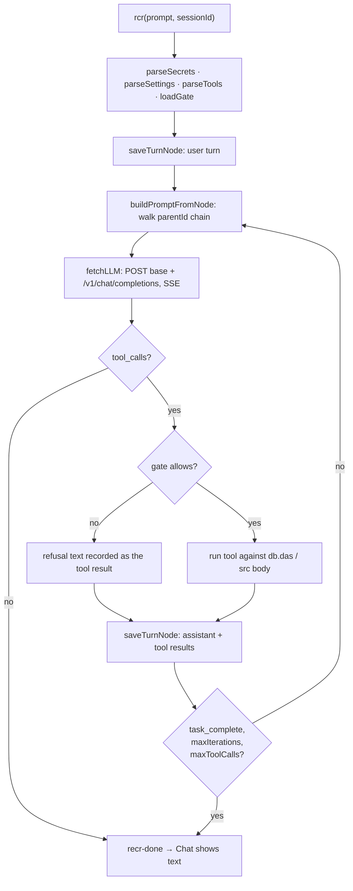
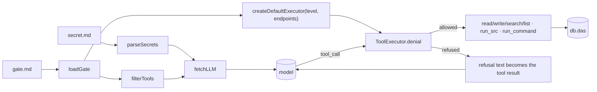
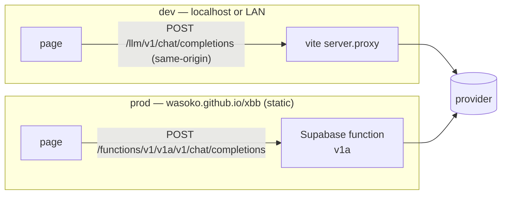

# recr — agentic tool-calling loop (xbb)

`recr` is a dependency-free agentic loop that calls an OpenAI-compatible chat API
with SSE streaming, runs the tools the model asks for, and feeds the results back
until the model stops or calls `task_complete`. It is the Chat half of the
`/tabs` page: the editor pane edits tag rows, the Chat pane edits them through a
model.

Structure borrowed from `tabext/docs/recr.md`; that file still describes the
pre-port `idb.db.tags` design, so this one is the authority for xbb. Grounded in:

- `src/recr.ts` — `rcr`, `runLoop`, `fetchLLM`, `ToolExecutor`, `parseSecrets`,
  `parseSettings`, `parseTools`, `buildPromptFromNode`, `saveTurnNode`
- `src/recrGate.ts` — `GateLevel`, `loadGate`, `gateTools`, `filterTools`
- `src/recrMd.ts` — the `## Section` / `* Key:` / `- item:` dialect
- `src/recrConst.ts` — shared ids · `src/recrPlugin.ts` — hook host (unused, R2)
- `src/sdb.ts` — `Da`, `db.das`, `isUiTag`, `getSecret`, `daRead`
- `src/ui/editor.tsx` — `Chat` · `vite.config.ts` — `/llm` dev proxy

Entity: `Da { tid, txt, ref, type, tags?, dt, modAt, rec }`, unique on
`type + ref`. recr's own keys are `type='recr'`; the secret and gate documents are
`type='md'`; a file is `ref=<path>` with `type` from its extension (`md` or
`src`). Everything shares one table, so sync, versioning, and the tag list come
for free — and must be filtered back out of the tag UI (§3, R4).

---

## 1. What it is and is not

| | |
|---|---|
| **Is** | One loop per user turn; provider-agnostic over `/v1/chat/completions`; tools read and write the same rows the editor shows |
| **Is not** | Not a server — the browser calls the provider directly (§5); not multi-agent; tool calls run sequentially, one turn at a time |

Four documents configure it, each parsed by its own reader and each optional: the
loop falls back to defaults when one is absent, except for `secret.md`, whose
absence is what stops a send.

---

## 2. The loop (`runLoop`)

The node is written **before** the first request and again after every round,
because `buildPromptFromNode` replays the branch from the store: a loop that only
wrote at the end would send the model no user turn and never show it the tool
results it asked for. `validateToolMessages` strips orphaned tool calls and
results on every rebuild.

Exit conditions are checked at the top of the loop; `task_complete` and an empty
`tool_calls` are the normal exits, the iteration and tool-call caps are the
safety net.

---

## 3. Where state lives

| Key (`ref`) | `type` | Content |
|---|---|---|
| `secret.md` | `md` | `## Default` + `## Providers` (§4) |
| `gate.md` | `md` | `## Selected` → `* Level:`, `## Endpoints` |
| `tools/{name}` | `recr` | tool override: heading + description + JSON schema fence |
| `settings/main` | `recr` | `* temperature: 0.7` style lines |
| `sess/{id}/meta` | `recr` | `BranchingSession` JSON (`currentHeadId`, `title`) |
| `sess/{id}/node/{nodeId}` | `recr` | `TurnNode` JSON: user, assistant, tool results, `parentId` |
| `src/*.ts`, `*.md` | `src`/`md` | file bodies; agent creates with tag `ai` |

Reads pick the row that wins for a `type + ref`: a row carrying `modAt` is a local
edit that has not been pushed yet, otherwise the newest `dt` wins; `[del]`-tagged
rows are skipped. Writes set `modAt`, which is exactly what `greet` pushes, so
sessions and settings replicate across clients like any other row (`docs/greet.md`).
Recr rows are hidden from the tag UI by `sdb.isUiTag` (`iq`, `stat_tags`).

File writes go through the editor's own recipe, `sdb.daEdit(row, txt)`: the text is
replaced and `modAt` set, which is exactly what `greet` pushes. A version enters
`rec.ver` or `rec.cr` only on the sync side (`docs/greet.md` §3).

---

## 4. Tool gate (`gate.md`)

Levels are cumulative; `read` is the floor and the default when the document is
missing, tombstoned, or names an unknown level.

| Level | Adds (cumulative) | What the model gains |
|---|---|---|
| `read` | `read_file`, `search_content`, `list_dir` | reads and searches existing rows |
| `rw` | `write_file` | creates rows (tagged `ai`), shelving the pre-edit version |
| `rwr` | `run_src` | runs a `type='src'` body or module in page context |
| `all` | `run_command` | REST calls to `## Endpoints` prefixes |

`task_complete` is never gated. The level is applied twice: `filterTools` keeps
the tools out of the request, and `ToolExecutor.denial` refuses the call if the
model asks for one from memory — a filter alone is not enforcement.

`run_src` reads the row body and picks one of two execution paths. A body whose
first token on a line is a static `import` or an `export` is imported as a module
from a `data:text/javascript` URL, and its default export is called with one `ctx`
argument (`{ db, ref, args, console }`); any other body builds an `AsyncFunction`
from the text, and a module keyword that shares a line with earlier statements is
detected from the constructor's syntax error. A specifier carries the whole body,
so identical text resolves to one module instance and module-level state survives
a repeated call. Both paths run in the page's realm with the page's privileges,
which is why the gate level, not the tool, is the authorization point.
`run_command` fails closed: an empty endpoint list refuses
every URL, and the caller's `Authorization` header is passed through rather than
stored server-side.

---

## 5. Reaching a provider: CORS decides the topology

`fetch` sends `Authorization`, which makes the request non-simple: the browser
preflights it. `ollama.com` answers `OPTIONS` with **405 and no
`Access-Control-Allow-Origin`** and adds no CORS header to the `401` either, so a
page can never call it directly. No client-side trick changes that — the request
needs something server-side in front of it.

| Environment | `* Base URL:` in `secret.md` | What answers the preflight |
|---|---|---|
| dev (`localhost`, `10.1.1.12`) | `/llm` | the Vite dev server (`LLM_PROXY_TARGET`, default `https://ollama.com`) — same-origin, so no preflight is sent |
| prod (GitHub Pages), `ollama.com` | `https://ollama.com` | the Supabase function `v1a`, which `fetchLLM` selects by hostname: it reads the Ollama key from `x-ollama-auth` and requires the signed-in session token in `Authorization` |
| prod (GitHub Pages), other provider | `https://<proxy-host>` | a hosted proxy the app owner deploys |
| extension (`tabext`) | `https://ollama.com` | `host_permissions: ["<all_urls>"]` lets the service worker fetch cross-origin; a DNR `modifyHeaders` rule (R6) can inject the CORS response headers instead |

`Base URL` is the provider **root** — `/v1/chat/completions` is appended, so
`https://ollama.com`, never `https://ollama.com/v1`. A relative value resolves
against the page origin, which is how one `secret.md` works on any dev host. The
`v1a` function pins host and path itself, so a `/v1` suffix on an
`ollama.com` base is dropped rather than doubled. It answers only an `Origin` on
its allowlist — `ALLOWED_ORIGIN`, comma-separated, defaulting to `localhost`,
`127.0.0.1`, `10.1.1.*`, and `https://wasoko.github.io` — and echoes that origin,
so no port is pinned and a rejected page reads a status instead of a missing
header. A failed `fetch` is reported with the proxy hint, because the browser
cannot distinguish a CORS refusal from an unreachable host.
---

## 6. Chat client (`ui/editor.tsx`)

| Concern | Mechanism |
|---|---|
| History | `loadBranchingSession(sid)` → `buildPromptFromNode(head)`; nothing in `localStorage` |
| Streaming | `rcr({ onProgress })` accumulates per-delta text into a live bubble |
| Tool rows | `recrBus` (`recr-tool-call` / `recr-tool-result`) appended as they happen |
| Stop | `AbortController`; an abort renders as `stopped`, not as an error |
| Errors | `rcr` rethrows, so the `catch` owns the error bubble — the bus error is not also rendered |
| Session key | URL `sid` param, else `default` |

---

## 7. Known gaps and divergences

- **R1 — `rcrStream` is broken and unused.** It yields only the last chunk once.
  The Chat streams through `onProgress` instead. Delete or reimplement before
  anyone reaches for it.
- **R2 — the plugin host is dispatched but empty.** `recrHost` runs its hooks on
  every phase, yet nothing calls `initDefaultPlugins`, so no `sess/{id}/req/*`
  row or tool trace is ever written. The 12 hooks cost a dispatch and buy nothing
  today.
- **R3 — the linear session path is dead.** `AgentSession`, `createSession`,
  `loadSession`, `saveSession`, and `buildPrompt` remain from before the branch
  model; only the `BranchingSession` path is used.
- **R4 — the tag UI must keep filtering `type='recr'`.** Recr rows live in the
  same table as tags, so a query that forgets `isUiTag` shows session nodes as
  files. `iq` (both its tag-filtered and its `tid`-anchored path) and `stat_tags`
  are covered; `availableDas` needs nothing because recr rows carry no `tags`.
- **R5 — secrets are plaintext and replicate.** `secret.md` is an ordinary `md`
  row: editing it in the UI sets `modAt`, so the API key is pushed to the server
  and lands in the S3 snapshot. Nothing encrypts it, and because the row syncs,
  every client of that snapshot resolves the same key. `sdb.getSecret` exists as
  a plain accessor for callers that want the document without parsing it.
- **R6 — the extension's CORS bypass cannot run as written.** `tabext/src/recr.ts`
  calls `chrome.declarativeNetRequest.updateDynamicRules`, but
  `tabext/ext/manifest.json` declares no `declarativeNetRequest` or
  `declarativeNetRequestWithHostAccess` permission, so the API is undefined and
  `setupCorsBypass()` throws on install. `modifyHeaders` also requires host
  access for the request URL — `<all_urls>` is already granted, so adding
  `declarativeNetRequestWithHostAccess` (no install-time warning) is the fix.
- **R7 — one session per URL, no fork UI.** `forkSession` exists and
  `tabext/docs/recr.md` records the tree as deliberate, but nothing in the UI
  branches: a session only ever grows a single chain.
- **Minor:** tool calls are sequential, so one slow tool blocks the turn;
  `usage` is only present when the provider honours
  `stream_options.include_usage`; `LLM_PROXY_TARGET` covers one provider at a
  time, so testing two needs a restart.

## 8. References

- `tabext/docs/recr.md` — original design write-up (pre-port store and paths)
- `tabext/src/recr.ts` — `setupCorsBypass` DNR rule, the extension-side answer to §5 (R6)
- `docs/greet.md` — the sync, `rec.ver`, and `deepMerge` rules the store reuses
- `src/recr.ts` — the loop and tool implementations
- `test/recr-secret.test.ts`, `test/recr-gate.test.ts`, `test/recr-tools.test.ts`,
  `test/recr-session.test.ts` — secret parsing, gate filtering and refusal,
  file/script tools, branch replay and `iq` filtering
