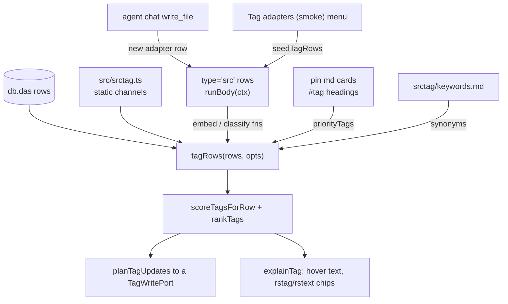

# Tagging (sTag)

`sTag` is the tag layer over `db.das`: what a row should be tagged with, which seams
produce that evidence, and how a decision becomes a `tags[]` write. Moved here from
`docs/filter_search.md`, which keeps the read path (`f` → `iq` → rows).

Two methodologies produce the evidence, and they differ in cost and in who can add one:

| | A. Static functions | B. Dynamic scripts |
|---|---|---|
| Lives in | `src/srctag.ts` — pure TypeScript, imports only `src/runsrc.ts` | `type='src'` rows, evaluated by `runsrc.runBody` |
| Adding one | a source edit: typecheck, tests, build | write the row in the editor, or let the agent chat write it — no build |
| Reachable by | whoever can ship the bundle | the app itself, a `run_src` tool call in a chat, `seedTagRows` |
| Cost per call | none: local and deterministic | a provider request, a key, a rate limit, a CORS origin |
| Belongs there | tokenizing, fusion, ranking, the row's own text | anything that calls a model or an external classifier |

The static half is the default and the fallback: it runs with no network at all, so a
missing adapter or a missing key degrades the score instead of stopping a sweep.

Everything below assumes one property of the module: rows arrive structurally as
`{ tid, txt, ref, type, tags, dt, modAt, rec }`, nothing in it imports Dexie, React or
the DOM, and writes leave through a caller-supplied `TagWritePort`. That is what lets
one file serve the webapp, a `run_src` row, and a copy inside the tabext extension.

## A. Static channels (`src/srctag.ts`)

### Fusion

| Channel | Source | Default weight |
|---|---|---|
| TF-IDF | `txt` tokens plus `urlTokens(ref)` and any Markdown link in `txt`, against the neighbour window | 0.35 |
| Embedding cosine | an injected `EmbedFn` against the neighbour centroid; `hashEmbed` (64-bin character histogram) when none is supplied | 0.35 |
| TextRank | `textRank()` over the row's own tokens: a weighted co-occurrence graph, normalized by its top rank | 0 |
| Burst TextRank (`clusterRank`) | the same walk over the neighbour window's pooled tokens, gated on the row's own copy of the term | 0 |
| Priority tags | `#tag` tokens in pin md-card headings (`pinPriorityTags`, the same rules `Cs1Renderer` renders) | 0.20 |
| Classifier labels | an injected `ClassifyFn` | 0.10 |

The two TextRank weights are 0 by default, so the default sweep is unchanged and pays
nothing for the graph: a zero weight skips the walk entirely. `RSTEXT_TAG_SCORE` is the
preset that turns them on and TF-IDF off, and `rstext` is the read path built on it.

`scoreTagsForRow` scores the candidates, `rankTags` filters and cuts. A candidate is
**only** a token of the row's own text, a keyword-trie match, or a classifier label —
the priority list cannot introduce a tag on its own, it only lifts one that already
qualified. `TagParts` keeps the shares apart (`tfidf`, `embed`, `textRank`,
`clusterRank`, `priority`, `keyword`, `suggest`); an entry in the trie sets `priority`
to `keywordBoost` (1.5) and reports the extra half as `keyword`, which is what
`explainTag` splits and `explanationText` prints. A channel whose weight is 0
contributes 0 and is left out of the tooltip rather than printed as `0.00`.

Weights live in `DEFAULT_TAG_SCORE` and are overridable per call; none is persisted.
`minScore` 0.05, `topK` 8 — the `rstext` preset raises both, because a TextRank value is
a normalized centrality and almost every token of a row clears 0.05.

### Lexical: TF-IDF

`tokenize` is NFKC + lowercase; Latin runs split on anything that is not a letter or
digit, are stop-worded (`STOP_WORDS`) and length-filtered; a CJK run is cut into sliding
bigrams by default, with `unigram` and `run` modes for callers that want them.
`urlTokens` adds a URL's hostname labels, path segments and percent-decoded query values,
minus `URL_STOP`. Term weight is sublinear (`1 + log tf`), IDF is
`log((N + 1) / (df + 1)) + 1`, and the row's vector is compared by cosine against the
centroid of its neighbours' vectors. With no neighbours the centroid falls back to the
row itself, so the channel reads 1 instead of dropping out.

### Lexical: TurboText (Aho–Corasick) trie

`TurboTextTagger` (also exported as `KeywordTagger`) is the keyword seam: an
Aho–Corasick automaton over the priority tags plus the surface forms in
`srctag/keywords.md`. Failure links make one left-to-right pass find every occurrence of
every keyword, so a scan costs O(text) whatever the dictionary holds and overlapping or
nested keywords are all reported. `match` keeps the older FlashText reading — longest
form wins and a match consumes its span, so one occurrence cannot yield two tags — while
`matchAll` and `counts` expose the automaton's whole output, which is what a caller
ranking terms by how often a keyword recurs needs. A Latin keyword may not sit inside a
longer word (`art` in `cart` fails the boundary test); an adjacent CJK character is
allowed, because CJK has no word spacing. `keywordEntries` gives each tag itself, its
hyphen/underscore form as spaced words, and any synonym the caller supplies;
`parseKeywordDoc` reads the `## tag` + `- keyword` document.

### TextRank centrality

`textRank(tokens, opts)` walks a co-occurrence graph: an edge joins two tokens at most
`window` apart, weighted by how often that pair recurs, and every node spreads its weight
over its neighbours in proportion to those weights — a PageRank over the token graph.
Scores are normalized by the highest one, so the top token always reads 1. The weighting
is what keeps a short title from collapsing: four distinct nouns in one title form a
complete graph, and an unweighted walk would call every one of them equally central.
Defaults live in `DEFAULT_TEXTRANK` — `window` 4, `damping` 0.85, `iterations` 30 with an
early stop at 1e-4 — and `tagRows` passes `opts.rank` through to them.

Two channels use it. `textRank` walks the row's own tokens and needs no corpus, which is
exactly its advantage over TF-IDF: a row's score does not depend on how rare its
neighbours made the term, so a burst of sibling links cannot flatten it. `clusterRank`
walks the neighbour window's pooled tokens and is gated on the row's own copy of the
term, so the burst can lift a tag the row already carries but can never introduce one —
the same rule the priority list follows.

A co-occurrence graph is still a lexical reading. RAKE, YAKE and any stemming-based
phrase extractor appear nowhere in this layer, and `dedupeTags`' plural strip is the only
stemming there is.

### Fallback: hashEmbed

`hashEmbed` is a 64-bin character histogram, unit-normalized. It is what the embedding
channel degrades to when no `EmbedFn` is configured, so the channel keeps a weak lexical
signal rather than disappearing; it is not a learned embedder and carries no semantics.

### Priority tags from pin cards

`pinTags` reads the Markdown headings of one card, strips closing hashes, and keeps
`#`-prefixed tokens that start a line or follow whitespace. The pattern's character class
is `[\p{L}\p{N}_]`, so a hyphen **ends** a tag: `#machine-learning` yields `machine` and
`learning` is left as text. `pinPriorityTags` concatenates the cards and de-duplicates
globally, in first-appearance order. Which rows count as cards is the caller's choice —
the app uses `type === 'md' && ref.startsWith('pin')`, the predicate in
`src/ui/cardTab.tsx`.

### Window, clusters, and the domain bucket

`TagWindowConfig.dim` chooses the ordering — `tid` (insert order), `dt`/`modAt`, or
`rec.visitTime`, read through the typo `rec.visitTIme` and the keys of
`rec.access2discard` the way `sdb.maxRecKey` does — and `defaultWindow(dim)` seeds
`burstGap` and `denseSpan` in that dimension's own unit (rows for `tid`, milliseconds
otherwise). `neighbourhood` counts local density across the whole working set (not the
window), shrinks the radius when `denseCount` rows sit within `denseSpan`, grows it when
a row has at most one local neighbour, and clamps to `[minWindow, maxWindow]`;
`clusterRows` cuts where two consecutive stamps differ by more than `burstGap`. The
window is clamped to the array, so an edge row simply has fewer neighbours. A row with
no stamp for the chosen dimension reads 0, so undated rows sort together and can form
one burst of their own.

`onlyTids` restricts which rows are *reported*, not which rows feed a window.

`opts.bucket: 'domain'` is a different axis from `dim`: `groupByDomain` splits the set by
hostname (`rowDomain`, `www.` stripped) and `tagRows` scores each site as its own working
set, so a row's peers are its site's rows rather than its neighbours in the array. This
is the reading a burst of sibling search results needs — those rows share vocabulary, so
a neighbour window finds the same terms everywhere. A bucketed run wraps the `EmbedFn`
in `memoEmbed`, so no title is embedded twice across the sites that hold it.

### Post-processing

`dedupeTags` walks the candidates in descending score order and drops the later one on two
tests: `tagStem` already produced its stem — a naive English plural strip, only for a
tag of five or more Latin letters, so `hooks` yields to `hook` — or it and an already-kept
tag contain one another after normalization while **both** are at least four characters.
The lower-scored of such a pair is the one that goes, which is why `react` beats `reactjs`
while `ml` and `mlx` coexist: the containment test needs both sides long enough.
`rankTags` filters below `minScore`, de-duplicates, then slices to `topK` — so a row's
final list is at most eight tags, each with its explanation still attached.

## B. Dynamic scripts (`type='src'` through `run_src` / `runBody`)

### The row contract

`runsrc.runBody(body, ctx)` decides by the body's text: a module — a line *starting*
with `import` or `export` — is turned into a `data:text/javascript` URL and its `default`
export is called with `ctx`; anything else is compiled as an async function body with
`ctx` and its `return` value is the result. `ctx` is `{ db, ref, args, console }`, so a
row reaches the store through `ctx.db` and its parameters through `ctx.args`. A module's
source text is its identity: two identical bodies are one instance, so module-level state
survives across calls.

Two rows return adapters — a function body `return`s the adapter, a module exports
`default (ctx) => adapter` — and `loadTagAdapter` takes it. One row returns a report.
A missing row is a normal state, not an error: the sweep then runs on the static channels
alone. A row that loads but throws does so at *call* time, which is why each body reads
its secret per call rather than at load.

### The seeded rows

| Ref | Kind | Results in |
|---|---|---|
| `srctag/embed.js` | src | an `EmbedFn` over one provider |
| `srctag/classify.js` | src | a `ClassifyFn` over classifier.dev |
| `srctag/suggest.js` | src | the rule-comparison report |
| `srctag/suggest-ds.js` | src | the same report, API channels defaulted to `ds` |
| `srctag/keywords.md` | md | surface forms for the trie, in the `parseKeywordDoc` dialect |

The bodies are text in `src/srctagRows.ts` (`SRCTAG_EMBED_BODY`, `SRCTAG_CLASSIFY_BODY`,
`SRCTAG_SUGGEST_BODY`, `SRCTAG_SUGGEST_DS_BODY`, `SRCTAG_KEYWORDS_DOC`) with the refs
living in `src/srctag.ts`. `suggest.js` and `suggest-ds.js` come from one private
`suggestBody(defaults)` factory, so they share every line except the `DEFAULTS` literal
that names a provider.

Because a `data:`-URL module cannot resolve an import, each body inlines what it needs:
the `secret.md` reader and the response normalizer are repeated across the adapter rows
on purpose.

### Provider resolution

A body reads its endpoint from `secret.md` under `## Providers` / `### <name>`:
`* Base URL:`, `- alias: model` under `* Models:`, and the first `- name: key` under
`* API Keys:`. `ctx.args.provider` / `ctx.args.model` override the row's own defaults, so
`{ provider: 'ere', model: 'nbed' }` moves the same row from Cloudflare to OpenRouter
without reseeding it. The secret is read per call, so an unknown provider or a missing key
is reported to the caller instead of making the row silently unloadable. These are the
same keys `recr.parseSecrets` reads for the chat, and the key rotation in
`settings/keys` applies to `recr`'s own requests, not to these rows, which always take the
provider's first listed key.

### Request shapes

The body picks the shape from the Base URL, with `ctx.args.shape` to force it:

| Base URL | Request | Response read |
|---|---|---|
| a `/ai/run` root (Cloudflare Workers AI) | `{ text: [...] }`, the whole batch | `result.data` |
| anything else | `{ model, input, encoding_format: 'float' }` | `data[].embedding`, sorted by `index` |
| classifier.dev | `POST {base}/v1/classify` with `{ inputs, labels, instructions }` | `labels` / `results` / `outputs` / a bare array, normalized to `{ tag, score }` |

### Provider matrix

| Provider | Block seen in `secret.md` | Base URL | Credential |
|---|---|---|---|
| Cloudflare Workers AI (`@cf/baai/bge-m3`) | `cfw` / `bge` in the seeded defaults | `https://api.cloudflare.com/client/v4/accounts/<acct>/ai/run` | bearer token |
| Silicon Flow (`BAAI/bge-m3`) | any OpenAI-compatible block | `https://api.siliconflow.cn` | bearer token |
| OpenRouter (`nvidia/nemotron-3-embed-1b:free`) | `ere` / `nbed` in the tests | `https://openrouter.ai/api` | bearer token |
| classifier.dev | `cjev` in the seeded defaults | `https://classifier.dev` | optional |
| `ds` | whatever the document defines | whatever the document defines | first listed key |

The page origin must be allowed by the provider: a browser cannot reach a provider that
refuses CORS, which is why a chat routes `/v1/chat/completions` through the Vite proxy
(`docs/recr-agloop.md`) and why the embedding rows point at providers that answer
preflights. The `ds` flavour of `suggest.js` only resolves as far as `secret.md` goes — the
body posts the OpenAI-compatible embeddings shape, so that block needs a model that
answers `/v1/embeddings`, and a chat-completions-only endpoint will fail at call time.

### In-process clients, for callers holding a key

The same providers are reachable without a row: `createEmbedClient` (OpenAI-compatible),
`createSiliconFlowEmbed`, `createOpenRouterEmbed`, `createCloudflareEmbed`,
`createClassifierDevClassify`, plus `embedBatch` for chunking and `embedWithCache` with a
caller-supplied `TagVectorCache` memoizing per `model|text`. These are for callers that
hold a key directly — `test/srctag.test.ts` is the only one today — and they are what the
rows re-implement as text; the app itself goes through the rows, because that is the half a
user can change without a build. The `vecs` table (`[tid+mdl]`) is declared and appears in
`sdb.stat()`'s stats line, but nothing writes or reads a vector there: the cache in use is
the caller-supplied `TagVectorCache`, and a vector stored per row would go stale on any
text edit anyway.

### Seeding, smoke, clearing

Nothing seeds the rows on its own. `seedTagRows(table)` writes any ref that has no live
row — an existing row is kept, never overwritten — and `clearTagRows(table)` tombstones
what it wrote, so the removal syncs instead of letting a remote copy resurrect it. The
`Tag adapters (smoke)` item in the userbar settings menu (`src/ui/srctagSmoke.ts`) seeds
them, loads them through `loadAdaptersFromStore`, and runs one live call per adapter,
reporting each failure as a line instead of throwing.

### What a script can call

`installSrctagGlobal()` publishes `srctagApi()` on `globalThis.srctag`, and
`src/ui/routes.tsx` calls it at boot — a `data:`-URL module cannot resolve a relative
import, so a row's only route to the static half is that global. It exposes `tagRows`,
`tagRowsForPinSave`, `tagRowsInteractive`, `tagSweepRows`, `planTagUpdates`,
`commitTagUpdates`, `dexieTagPort`, `customTagPort`, `pinPriorityTags`,
`loadAdaptersFromStore`, `keywordEntries`, `parseKeywordDoc`, `tokenize`, `rankTags`,
`textRank`, `summarizeTagRun`, `groupByDomain` and `rowDomain`, so a row can score rows,
read the graph channels, and write tags without reimplementing any of it.

### Authoring a row from the agent chat

A new adapter is a row, not a release. The chat's `write_file` tool goes through the same
store the editor uses, and `daType(ref)` types a ref by its suffix — `.md` becomes an `md`
row, everything else a `src` row — which is why `srctag/embed-openrouter.js` written by
the agent lands as a `type='src'` row (tagged `ai`, so the tag UI can find it).
`run_src` then runs it: `{ ref: 'srctag/my-adapter.js', args: { provider, model } }`. The
gate decides whether that is possible at all — `run_src` needs level `rwr` or above in
`gate.md`, while the static channels need no permission. The same loop is how
`srctag/suggest.js` is meant to be read back and adjusted: the report says which rule
proposed more, and the next script is written from those numbers.

### Comparing rules (`srctag/suggest.js`)

`suggest.js` is the reporting row: it reads the working set out of `ctx.db`, drops the pin
cards from the scored rows while taking their `#tag` headings as the priority tags, and
scores the set once per rule — `tid`, `dt`, `visitTime`, and the `suffix_*` tag
`fc.txtRx` writes on a title tail, where the rows sharing a tag become one another's
neighbourhood. Each rule gets its row and suggestion counts, distinct tags, mean and max
score, priority-tag hits, and its Jaccard overlap with `tid`, so "which rule proposes
more" is a number rather than a preference. `args.adapters: false` keeps it on the static
channels and off the network; `args.detail`, `args.topK` and `args.bucketLimit` trade
report size for the 8000-character result `run_src` returns. `suffixGroups` lists only the
buckets that fit in that budget, while `suffixBuckets` reports the true total, because a
real table carries more buckets than the report can hold.

A caveat the report states about itself: a `suffix_*` tag groups rows without ever being
suggested, because `rowSources` reads a row's `txt` and URLs and not its `tags`. Making
`suffix_*` a candidate would mean feeding `row.tags` into the token sources, which is a
behaviour change for every existing row, not a script change.

## Measuring a channel set (`test/srctag-cdp.test.ts`)

Choosing between the channels is a measurement, not a preference, and the measurement runs
against the user's own table. `test/srctag-cdp.test.ts` connects to the browser on
`:9222`, reads the live `tagDB_0` out of the page at `localhost:5173`, and runs `tagRows`
in Node over those rows, so the working set is the tabs the user actually has. The first
describe replays the `src`-row bodies; the second, `hybrid sweep over the live working
set`, is the comparison:

- every channel set in `CHANNEL_CASES`, one ordering each — `tfidf` as the baseline,
  `textrank` on `tid`/`dt`/`visitTime`/`domain`, a `hybrid` mix, and the `rstext` preset;
- `HYPER_CASES`, which move one knob at a time around `RSTEXT_TAG_SCORE` — `topK`,
  `minScore`, the window radius, the TextRank window and damping, `burstGap`, and the
  effect of dropping `clusterRank`, dropping the priority channel, or putting TF-IDF back;
- the dynamic pair, `rstext+embed` and `hybrid+embed+classify`, over a 24-row sample
  because the classifier costs one request per row.

`summarizeTagRun` folds a run into the printed numbers: rows, rows that kept a tag, empty
rows, suggestions, distinct tags, mean and max score, priority hits, the share each
channel contributed, and the tags that spread widest. The channel shares come from
`explainTag`, so they add up to the run's score total. Each run also gets its wall time
and its Jaccard overlap with the baseline, which is the number that says whether two
channel sets are telling the user the same thing.

The dynamic path is exercised twice over. The sweep reports what the live store holds, and
when it holds no adapter row the same code runs against a stub provider the test starts on
`127.0.0.1`: the real `srctag/embed.js` and `srctag/classify.js` bodies load through
`loadAdaptersFromStore`, resolve their Base URL out of a synthetic `secret.md`, post the
real request shapes, and their replies feed the fusion. `SRCTAG_CDP_LIMIT`,
`SRCTAG_API_SAMPLE` and `SRCTAG_SKIP_API=1` trim the run; `pnpm vitest run
test/srctag-cdp.test.ts --reporter=verbose` prints the tables into `test.log`.

What the live table (1499 rows, one pin card with six tags) showed on 2026-10-08, before
any tuning:

| Case | rows scored | suggestions | distinct | mean | max | ms |
|---|---|---|---|---|---|---|
| `tfidf` | 175 | 801 | 561 | 0.126 | 0.958 | 155 |
| `textrank` | 1499 | 10643 | 4921 | 0.898 | 1.907 | 870 |
| `textrank@domain` | 1499 | 10644 | 4479 | 0.982 | 2.250 | 550 |
| `rstext` | 1499 | 6958 | 2519 | 0.692 | 1.750 | 579 |

Three facts fall out of that. TF-IDF leaves 1324 of 1499 rows with nothing to suggest,
while TextRank keeps the default cut-off trivial — every row clears `minScore` 0.05, which
is why `RSTEXT_TAG_SCORE` raises it to 0.4 and `topK` to 5. On the same table `minScore
0.02` and `minScore 0.2` are then indistinguishable (7188 and 7186 suggestions), and
`minScore 0.7` is what starts to bite (1237 rows kept, 262 empty), so a TextRank-driven
preset's cut-off belongs an order of magnitude above the TF-IDF default. And `clusterRank`
is not decoration: dropping it moves 31% of the tags the preset proposes.

The sweep is the selection step, not the answer. Which cut-off, window, and weight mix is
right for a user depends on their own table, which is why the numbers are printed per
hyperparameter rather than frozen into a constant.

## Write path

`planTagUpdates` turns results into `{ tags, rec }`. `add` only adds, `replaceAuto` also
removes tags the row's own `rec.tagAuto` provenance names, `replace` sets the list
outright, and `[del]` plus the `keep` list survive all three. `dexieTagPort` writes
`tags`, `rec` and a local `modAt`; `commitTagUpdates` sequences writes; a row without a
`tid` is skipped. `dexieTagPort` does not shelf a version the way `sdb.daEdit` does, so an
auto-written tag never reaches the diff tab; `src/ui/tagApply.ts` is the app-side port
that writes through `daEdit` instead. Because `rec` merges by union (`fc.recMerge` through
`sdb.deepMerge`), a provenance key removed on one client returns when a copy still
carrying it merges in.

## Entry points

| Use | Call | Default window |
|---|---|---|
| pin card saved | `tagRowsForPinSave(pins, rows)` | `visitTime` |
| agent chat, user-picked rows | `tagRowsInteractive(rows, tids)` | `tid` |
| extension tab sweep | `tagSweepRows(rows)` | `tid` |
| rest-list chips (`rstag`) | `tagRowReports(rows)` via `ui/restGrouper.restTagMap` | `tid` |
| rest-list chips (`rstext`) | `tagRowReports(rows)` via `ui/restGrouper.restTextMap` | `visitTime`, bucketed by domain |
| rule comparison (`run_src`) | `run_src('srctag/suggest.js')` | all four, side by side |

All of them are `tagRows` with defaults; `onlyTids`, `priorityTags`, `synonyms`, `embed`,
`embeddings`, `classify`, `labels`, `rank` and `bucket` are per-call options.

`tagRowReports` is the read-only entry point: it scores with the lexical channels alone
unless `embed`/`classify` is injected, and returns one `RowTagReport` per row — the window
and cluster the score was measured in, plus one `TagExplanation` per tag. `explainTag`
splits a suggestion into its channel shares, so `channels[].contribution` adds up to
`score`, and `explanationText` formats that as the hover text.
Written tags land in the `*tags` MultiEntry index that `iq` and `availableDas` read, so a
tag write is immediately a filter crumb; `rec.tagAuto` is read by nothing in the read
path. The userbar search box tags the rows its dropdown shows (`src/ui/tagApply.ts`): the
query's tokens become priority tags, the write is add-only, and the toast carries a
revert. Focusing the empty box shows two zones instead of results — `srctag`'s
suggestions, ranked by the rest list's own pass (`restTagStore.rank`: tags ordered by how
many scored rows suggest them, then by best score; clicking applies one), then the most
used tags from `availableDas` (clicking searches one). `iq`'s `search` argument is still
unwired.

## Read-only chips (`restGrouper: 'rstag'`)

`rstag` is `rsdt` plus a tag layer: the blocks come from `groupByDt` synchronously, while
`ui/restGrouper.restTagMap` scores the newest 200 rows in a live query and returns
`Map<tid, RowTagReport>`, dropping any tag a row already carries. Each report's tags
render **in front of** its row as dotted-outline chips (`src/ui/cardTab.tsx`), so a tag
reads as the delimiter of the item it precedes, and the row carries a capline — an
overline, the opposite of the hover underline — in its leading tag's color, which is the
same color that chip uses. That color is `getColorChar11`'s hue lifted, because the panel
is dark and the function draws tags at lightness 0.2 for the filled chips the hover
preview and cs1 paint. The rows' own tags seed the trie's priority channel, so a row that
carries `react` still lends `react` to its neighbours. Nothing is written, and a chip's
`title` carries `explanationText`: the score, the `tfidf`/`embed`/`textrank`/
`clusterrank`/`priority`/`turbotext`/`classify` shares, the neighbour window, and the
reminder that the tag is only a suggestion. Persisting one is still the search box's job.

## Read-only chips (`restGrouper: 'rstext'`)

`rstext` renders the same blocks and the same chips from a different pass. Where `rstag`
reads a row against its `tid` neighbours with TF-IDF carrying the score, `restTextMap`
runs `RSTEXT_TAG_SCORE` — TF-IDF and embeddings off, `textRank` and `clusterRank` on —
with `bucket: 'domain'` and the `visitTime` window, so a row is read against its own
site and the terms it shares with the rest of that site. The chips and their tooltips are
identical; only the numbers differ, and the `rstext` tooltip shows no `tfidf` line because
that channel contributes 0.

Both groupers keep `rsdt`'s blocks, so the mode is a decoration layer and the list paints
before the tags arrive. `restTagStore` receives whichever pass ran, so the userbar
omnibox's suggestion zone ranks the same reports either way.

## Review notes

Findings from moving and re-reading this material, worth knowing before changing it:

- The old section ran the static channels and the seeded rows together as one narrative,
  which hid the point that only one of the two costs a network call, a key and a build
  gate. They are separate methodologies here.
- A priority tag that the row's text does not also contain is not a candidate at all —
  it lifts an existing candidate rather than creating one. Only the trie's keyword match
  and the classifier can introduce a tag from outside the row.
- `pinTags` ends a tag at a hyphen, so `#machine-learning` becomes `machine`.
- `hashEmbed` is a fallback signal, not an embedding; a sweep that never injects an
  `EmbedFn` still reports a non-zero `embed` share.
- The keyword matcher is an Aho–Corasick automaton (`TurboTextTagger`, exported twice as
  that name and as `KeywordTagger`); RAKE and YAKE appear nowhere in the code.
- TextRank is implemented as a *weighted* walk on purpose. An unweighted walk over a
  four-token title lands on a complete graph and reports every token as equally central,
  which is indistinguishable from no ranking at all — the weight is what makes the channel
  do anything on titles this short.
- `clusterRank` can never introduce a tag: it is gated on the row's own copy of the term,
  the same rule the priority channel follows. A tag a sibling row has and this row does
  not is not a candidate here, and the sweep for a domain bucket confirms it.
- `vecs` is declared in the schema and counted in `sdb.stat()`'s stats line, but no vector
  is written to it or read from it; the cache that exists is `embedWithCache`'s
  caller-supplied `TagVectorCache`.
- The `srctag/*` rows reach `srctag`'s fusion only through `globalThis.srctag`, so a row
  run outside the app (a test, a worker) must have the API published for it or it returns
  an error object rather than throwing.
- A bucketed run calls the `EmbedFn` once per site, so an embedder that bills per request
  pays per site holding a new title. `memoEmbed` keeps that from costing a request per
  duplicate title; a single request for the whole table is not what this path does.
- Live check on a real table (400-row window, pin cards excluded): 299 rows scored, 53
  `suffix_*` buckets, ranking `suffix_*` > `dt` > `tid` > `visitTime`. Reproduce with
  `npx vitest run test/srctag-cdp.test.ts --reporter=verbose --silent=false`, which reads
  the running app's own IndexedDB over CDP and runs the rows in the page as well as in
  Node. The same file's second describe is the channel and hyperparameter sweep (above).

## Related

- `docs/filter_search.md` — the read path these tags feed.
- `docs/recr-agloop.md` — `run_src`, the `rwr` gate, and `secret.md`.
- `src/srctag.ts`, `src/srctagRows.ts`, `src/runsrc.ts`, `src/ui/restGrouper.ts`,
  `src/ui/tagApply.ts`.
