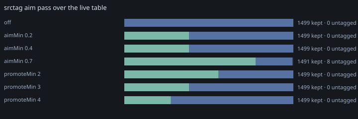

# srctag sweep over the live table

Recorded 2026-10-10 by `test/srctag-cdp.test.ts` against the running app on `localhost:5173`.
Rows, channel sets and dates come from that page’s own IndexedDB, so the numbers are
this table’s, not a fixture’s. Re-record with:

```sh
npx vitest run test/srctag-cdp.test.ts --reporter=verbose --silent=false
```

## static channels over 1499 live rows · priority from pin cards (1) (6 tags)

| case | dim | rows | scored | empty | sugg | dist | mean | max | prio | jaccard | ms | channels |
| --- | --- | --- | --- | --- | --- | --- | --- | --- | --- | --- | --- | --- |
| tfidf | tid | 1499 | 175 | 1324 | 801 | 561 | 0.126 | 0.958 | 38 | 1.000 | 167ms | tfidf 0.72 · priority 0.19 · keyword 0.09 |
| textrank | tid | 1499 | 1499 | 0 | 10643 | 4921 | 0.898 | 1.907 | 35 | 0.083 | 867ms | textRank 0.92 · clusterRank 0.08 · priority 0.00 · keyword 0.00 |
| textrank@visitTime | visitTime | 1499 | 1499 | 0 | 10644 | 4913 | 0.898 | 1.897 | 35 | 0.082 | 1283ms | textRank 0.92 · clusterRank 0.08 · priority 0.00 · keyword 0.00 |
| textrank@dt | dt | 1499 | 1499 | 0 | 10644 | 4912 | 0.898 | 1.897 | 35 | 0.082 | 962ms | textRank 0.92 · clusterRank 0.08 · priority 0.00 · keyword 0.00 |
| textrank@domain | domain | 1499 | 1499 | 0 | 10644 | 4479 | 0.982 | 2.250 | 35 | 0.088 | 665ms | textRank 0.82 · clusterRank 0.17 · priority 0.00 · keyword 0.00 |
| hybrid | visitTime | 1499 | 1499 | 0 | 10640 | 4916 | 0.464 | 1.261 | 38 | 0.085 | 873ms | textRank 0.88 · clusterRank 0.10 · tfidf 0.01 · priority 0.00 · keyword 0.00 |
| rstext | domain | 1499 | 1499 | 0 | 6958 | 2519 | 0.692 | 1.750 | 38 | 0.102 | 612ms | textRank 0.72 · clusterRank 0.27 · priority 0.00 · keyword 0.00 |
| rstext+embed | domain | 24 | 24 | 0 | 132 | 100 | 0.412 | 1.300 | 3 | 0.000 | 12ms | textRank 0.81 · clusterRank 0.15 · priority 0.02 · keyword 0.01 |
| hybrid+embed+classify | visitTime | 24 | 24 | 0 | 132 | 108 | 0.293 | 0.750 | 3 | 0.000 | 13ms | textRank 0.88 · clusterRank 0.08 · priority 0.02 · tfidf 0.01 · keyword 0.01 |

## hyperparameters around the rstext preset, 1499 live rows

| case | dim | rows | scored | empty | sugg | dist | mean | max | prio | jaccard | ms | channels |
| --- | --- | --- | --- | --- | --- | --- | --- | --- | --- | --- | --- | --- |
| rstext anchor | domain | 1499 | 1499 | 0 | 6958 | 2519 | 0.692 | 1.750 | 38 | 0.000 | 608ms | textRank 0.72 · clusterRank 0.27 · priority 0.00 · keyword 0.00 |
| topK 4 | domain | 1499 | 1499 | 0 | 5733 | 1951 | 0.716 | 1.750 | 38 | 0.775 | 667ms | textRank 0.70 · clusterRank 0.30 · priority 0.00 · keyword 0.00 |
| topK 16 | domain | 1499 | 1499 | 0 | 13615 | 6205 | 0.611 | 1.750 | 38 | 0.406 | 584ms | textRank 0.81 · clusterRank 0.19 · priority 0.00 · keyword 0.00 |
| minScore 0.02 | domain | 1499 | 1499 | 0 | 7188 | 2652 | 0.681 | 1.750 | 38 | 0.950 | 694ms | textRank 0.73 · clusterRank 0.27 · priority 0.00 · keyword 0.00 |
| minScore 0.2 | domain | 1499 | 1499 | 0 | 7186 | 2651 | 0.681 | 1.750 | 38 | 0.950 | 623ms | textRank 0.73 · clusterRank 0.27 · priority 0.00 · keyword 0.00 |
| minScore 0.7 | domain | 1499 | 1237 | 262 | 2868 | 420 | 0.848 | 1.750 | 38 | 0.167 | 545ms | textRank 0.58 · clusterRank 0.41 · priority 0.01 · keyword 0.00 |
| window 2 | domain | 1499 | 1499 | 0 | 6953 | 2590 | 0.687 | 1.750 | 38 | 0.921 | 390ms | textRank 0.73 · clusterRank 0.26 · priority 0.00 · keyword 0.00 |
| window 8 | domain | 1499 | 1499 | 0 | 6964 | 2505 | 0.689 | 1.750 | 38 | 0.938 | 933ms | textRank 0.73 · clusterRank 0.27 · priority 0.00 · keyword 0.00 |
| rank window 2 | domain | 1499 | 1499 | 0 | 6839 | 2417 | 0.694 | 1.750 | 38 | 0.450 | 421ms | textRank 0.72 · clusterRank 0.28 · priority 0.00 · keyword 0.00 |
| rank window 8 | domain | 1499 | 1499 | 0 | 6893 | 2506 | 0.707 | 1.750 | 38 | 0.520 | 849ms | textRank 0.72 · clusterRank 0.27 · priority 0.00 · keyword 0.00 |
| damping 0.5 | domain | 1499 | 1499 | 0 | 7126 | 2432 | 0.728 | 1.750 | 38 | 0.839 | 429ms | textRank 0.71 · clusterRank 0.28 · priority 0.00 · keyword 0.00 |
| damping 0.95 | domain | 1499 | 1499 | 0 | 6919 | 2604 | 0.686 | 1.750 | 38 | 0.913 | 637ms | textRank 0.73 · clusterRank 0.27 · priority 0.00 · keyword 0.00 |
| no clusterRank | domain | 1499 | 1499 | 0 | 6486 | 3456 | 0.556 | 1.350 | 38 | 0.693 | 250ms | textRank 0.99 · priority 0.01 · keyword 0.00 |
| no turboText | domain | 1499 | 1499 | 0 | 6953 | 2525 | 0.689 | 1.000 | 16 | 0.996 | 593ms | textRank 0.73 · clusterRank 0.27 |
| tfidf back on | domain | 1499 | 1499 | 0 | 7064 | 2638 | 0.745 | 1.916 | 38 | 0.942 | 547ms | textRank 0.67 · clusterRank 0.25 · tfidf 0.08 · priority 0.00 · keyword 0.00 |
| burstGap 60s | domain | 1499 | 1499 | 0 | 6958 | 2519 | 0.692 | 1.750 | 38 | 1.000 | 609ms | textRank 0.72 · clusterRank 0.27 · priority 0.00 · keyword 0.00 |

## aim pass over 1499 live rows · priority from pin cards (1) (6 tags)

| case | aimMin | promote | rows | untagged | prio | focus/row | tags/row | sub rows | sub tags | ms |
| --- | --- | --- | --- | --- | --- | --- | --- | --- | --- | --- |
| off | 0.40 | 3 | 1499 | 0 | 38 | 4.47 | 4.47 | 0 | 0 | 0ms |
| aimMin 0.2 | 0.20 | 3 | 1499 | 0 | 38 | 4.47 | 5.12 | 573 | 77 | 6ms |
| aimMin 0.4 | 0.40 | 3 | 1499 | 0 | 38 | 4.47 | 5.12 | 573 | 77 | 4ms |
| aimMin 0.7 | 0.70 | 3 | 1499 | 8 | 38 | 0.79 | 2.24 | 1164 | 48 | 4ms |
| promoteMin 2 | 0.40 | 2 | 1499 | 0 | 38 | 4.47 | 5.53 | 834 | 253 | 4ms |
| promoteMin 3 | 0.40 | 3 | 1499 | 0 | 38 | 4.47 | 5.12 | 573 | 77 | 4ms |
| promoteMin 4 | 0.40 | 4 | 1499 | 0 | 38 | 4.47 | 4.94 | 412 | 35 | 5ms |

## dynamic channels against a local provider, 24 live rows

| case | dim | rows | scored | empty | sugg | dist | mean | max | prio | jaccard | ms | channels |
| --- | --- | --- | --- | --- | --- | --- | --- | --- | --- | --- | --- | --- |
| rstext+embed | domain | 24 | 24 | 0 | 132 | 112 | 0.820 | 1.713 | 3 | 0.000 | 281ms | embed 0.51 · textRank 0.42 · clusterRank 0.05 · priority 0.01 · keyword 0.01 |
| hybrid+embed+classify | visitTime | 24 | 24 | 0 | 146 | 118 | 0.501 | 1.028 | 3 | 0.000 | 55ms | textRank 0.47 · embed 0.45 · suggest 0.03 · clusterRank 0.03 · priority 0.01 · tfidf 0.01 · keyword 0.01 |

## aim pass


